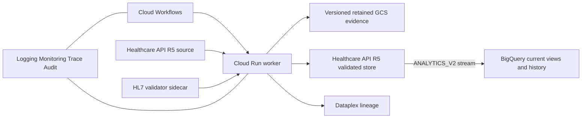

# EMA Flow

EMA Flow is a Google Cloud architecture package that proves deterministic interoperability
between:

1. a published HL7 Global ePI 1.0.0 Type 2 product graph and authoritative SmPC sections;
2. the EMA EU ePI 1.0.0 English CAP SmPC QRD profile chain; and
3. near-real-time analytical records streamed natively from Cloud Healthcare API R5 to
   BigQuery.

It deliberately has no bespoke operations dashboard. Cloud Workflows, Cloud Logging,
Cloud Monitoring, Cloud Trace, Cloud Audit Logs, Dataplex Data Lineage, and BigQuery Studio
are the operator interface.

**North star:** `docs/vision.md`. **Plan of record:** `docs/roadmap.md`, `docs/foundations.md`.

## What the demonstration proves

- Complete Type 2 graph preflight, including structured product, authorization, package,
  manufactured/administrable product, ingredient, substance, and organization resources.
- Fail-closed conversion of supplied canonical SmPC sections to the exact English CAP QRD
  hierarchy.
- A mechanical fidelity check of supplied narrative; clinical text is never generated or
  rewritten, and only an authority import may drop presentation (ADR 0005).
- A `ConceptMap` of every section slot of the EMA's CAP SmPC template profile, and a
  `StructureMap` that is the crosswalk's executed twin (`src/fhir/transform.ts` executes the
  crosswalk; CI runs the map on the official validator's engine against it on every fixture, and
  validates both), field-level decisions, input/output hashes, validation `OperationOutcome`s, and
  KMS-signed run manifests.
- Validation by both the official HL7 validator and Healthcare API `$validate`.
- Idempotent FHIR transaction writes only after all required validation gates pass.
- Direct `ANALYTICS_V2` streaming from the validated R5 FHIR store to BigQuery. Google
  documents expected lag as typically dozens of seconds; the workflow waits for and records
  when the Bundle view becomes queryable.

This is a prototype and qualification-supporting architecture. It is not regulatory
certification, an EMA submission client, or a validated GxP system.

## Architecture



The document `Bundle` is retained as the exchange artifact. Its entries are also persisted
as top-level resources because BigQuery intentionally omits `Bundle.entry.resource` from its
analytical schema.

See [docs/architecture.md](docs/architecture.md) for trust boundaries, controls, and data flow,
and [docs/roadmap.md](docs/roadmap.md) for what is built and what is planned.

### Zone A hand-off contract

Structuring a label document into the Type 2 graph is a separate, probabilistic Zone A
service; this repository (Zone B) accepts only an approved `CanonicalSubmission`, passed by
reference, and re-verifies it before running the deterministic transform and validation
pipeline.
A submission is named, never inlined: `POST /v1/runs` takes `{uri, sha256}` into the submission
bucket, and the submission itself names its fidelity report and extracted text. Status: the
contract, the ingress gate, the reference resolver, the `document` route, and the Workflows
`document` branch exist; no Zone A service produces submissions yet. The producers are
`src/fixtures/synthetic-submission.ts` (synthetic) and, for an authority's published ePI,
`scripts/authority/import.ts`, whose output the worker recomputes from the authority's own files
before accepting it (ADR 0005; `docs/design/authority-import-contract.md`; dry run only for
now). The `fixture` and `healthcare-api` sources are pre-existing trusted inputs guarded by IAM,
not by this gate. The worker's run-source allowlist (`ENABLED_RUN_SOURCES`, Terraform
`enabled_run_sources`), enforced at HTTP and in `runPipeline`, follows `ALLOW_SYNTHETIC_SOURCES`,
which is off by default: then only `document` is enabled and enabling either ungated source fails
startup. The `dev` deploy turns it on. See
[docs/adr/0002-two-trust-zones-and-canonical-submission.md](docs/adr/0002-two-trust-zones-and-canonical-submission.md)
and
[docs/adr/0003-mechanical-narrative-fidelity.md](docs/adr/0003-mechanical-narrative-fidelity.md)
for the trust boundary and the mechanical narrative fidelity check. The contract's Zod schemas
are the source of truth; generated JSON Schema is checked into `contracts/generated/` and kept
in sync by `npm run contracts:check`, their versions by `contracts/versions.lock.json`. The golden
vectors in `test/fixtures/fidelity/` are the executable specification for any re-implementation of
the fidelity check.

## Local deterministic demonstration

Requirements: Node.js 22.22.0 exactly, with npm 10.9.4 (ADR 0003 pins the runtime).

```bash
npm ci
npm run artifacts:generate
npm run check
npm run demo
```

`npm run demo` needs no Google credentials and uses synthetic, explicitly non-clinical text.
It executes deterministic mapping and local structural gates. Production mode additionally
requires the official validator sidecar and Healthcare API validation.

Start the HTTP service in dry-run mode, accepting synthetic content (without the flag only the
`document` source is enabled):

```bash
ALLOW_SYNTHETIC_SOURCES=true npm run dev
curl -X POST http://127.0.0.1:8080/v1/runs \
  -H 'content-type: application/json' \
  -d '{"source":"fixture"}'
```

An approved Zone A hand-off is named rather than sent. `SUBMISSION_BUCKET` must be set, the
object must live in that bucket, and the hash must be the SHA-256 of the submission's canonical
JSON (`contracts/generated/run-request.schema.json`):

```bash
curl -X POST http://127.0.0.1:8080/v1/runs \
  -H 'content-type: application/json' \
  -d '{"source":"document","submissionRef":{"uri":"gs://BUCKET/smpc.submission.json","sha256":"<64 hex>"}}'
```

`GET /healthz` reports `documentSource: false` when no submission bucket is configured, and the
route then answers `503 document-source-not-configured` rather than failing obscurely. A source
outside `ENABLED_RUN_SOURCES` answers `422 { "error": "source-disabled" }` before any reader,
fixture, or client is touched.

## Google Cloud deployment

Prerequisites: a billing-enabled project in an EU region Cloud Healthcare API supports (default
`europe-west4`), `gcloud` credentials that can provision it, Terraform 1.16 or newer, and Cloud
Build permissions. Deploys run through `.github/workflows/deploy.yml` (below); a local run of
every phase is for emergencies only:

```bash
export GOOGLE_CLOUD_PROJECT="sage-ship-509104-b8" # the EXPECTED_PROJECT_ID of dev.env; any other is refused
export EMA_FLOW_ENVIRONMENT="dev"                 # no default
bash scripts/gcp/deploy.sh
```

Export the four `QUERY_*` variables as the repository variables hold them. Against a live
environment, an unset `QUERY_INVOKERS` or `QUERY_TOKEN_CREATORS` plans destroys of its grants, and
so does running as a user account rather than the deployer (`deployer_invoker`,
`deployer_fhir_editor`): the apply refuses them unless `ALLOW_REPLACE_ACK` names them (below). An
unset entitlement map or client list empties it without a destroy. `smoke` needs
`WORKER_ID_TOKEN` (see "Re-ingesting with `scripts/demo/seed.ts`"). An environment's other inputs
are in `scripts/gcp/environments/<env>.env`. Every operator script in `scripts/gcp/` takes
`--help` (which, for `deploy.sh`, lists the phases) and exits 2 on an
unknown argument. The phases, in order: `preflight`; `init` (the state bucket, on its key);
`apis`; `images` (Cloud Build, `cloudbuild.images.yaml`, builds the worker, validator and query
images; submitted by hand without `phase_images`' `--region`, `--service-account` and
`--gcs-source-staging-dir`, the build is refused); `apply` (images by digest; Binary
Authorization is configurable and off by default); `record-readers`; `bootstrap` (reconciles the
R5 stores and their BigQuery stream over REST, since the Terraform provider rejects R5, imports
the pinned profiles and seeds `Bundle/synthetic-type2-smpc`); `smoke` (one fixture run must
persist); and `query-smoke`. A local run also installs the packages and makes the deploy's
inputs (`scripts/gcp/deploy-inputs.sh`; a legitimate change to the synthetic fixture updates its
hash in `fhir/deploy-inputs.lock.json`). In Actions the `gate` job makes them, and the `deploy`
job, which installs nothing, waits for CI's run on the commit first.

Each apply, and the profile prune in `bootstrap`, refuses a plan that destroys or replaces
anything unless `ALLOW_REPLACE_ACK` names the commit and a digest of exactly those destroys (the
refusing run prints the value; in Actions it is the workflow's `allow_replace_ack` input). The
`apis` plan, the full plan and the prune each compute their own digest, so a change that needs
two of them fails at the second and needs a second run with its value.

### GitHub Actions deployment

The deploy remote is
[ogbetspp-coder/fhir_real_time_data_exchange](https://github.com/ogbetspp-coder/fhir_real_time_data_exchange).
The workflow runs for pushes to `main` and can also be started from
**Actions → Deploy to Google Cloud → Run workflow**.

It uses GitHub's OIDC token with Google Cloud Workload Identity Federation, so no
service-account key is stored in GitHub. In that repository, set these Actions variables:

| Variable                         | Example                                                                                  |
| -------------------------------- | ---------------------------------------------------------------------------------------- |
| `GCP_PROJECT_ID`                 | your Google Cloud project id                                                             |
| `GCP_REGION`                     | `europe-west4`                                                                           |
| `GCP_DEPLOY_SERVICE_ACCOUNT`     | `ema-flow-deployer@PROJECT_ID.iam.gserviceaccount.com`                                   |
| `GCP_WORKLOAD_IDENTITY_PROVIDER` | `projects/PROJECT_NUMBER/locations/global/workloadIdentityPools/POOL/providers/PROVIDER` |

The pull-request plan (`.github/workflows/plan.yml`) takes two more, `GCP_PLAN_SERVICE_ACCOUNT`
and `GCP_PLAN_WORKLOAD_IDENTITY_PROVIDER`, for its own read-only identity
(`docs/foundations.md`, B4).

Four further Actions variables configure who may call the query service. They are variables,
not secrets: an IAM member string, an opaque subject id, a FHIR bundle id and an OAuth client id
are identifiers, and holding one grants nothing. Each is optional; an unset variable leaves the
Terraform default, and a deploy with all of them unset succeeds and authorises no caller. Outside
`dev`, `ALERT_NOTIFICATION_EMAIL` or `ALERT_NOTIFICATION_CHANNELS` is required and must not be a
placeholder; `dev` pages no one and is given neither (`infra/README.md`, Inputs).

| Variable                  | Example                                                           | Default when unset |
| ------------------------- | ----------------------------------------------------------------- | ------------------ |
| `QUERY_INVOKERS`          | `user:you@example.com,serviceAccount:a@p.iam.gserviceaccount.com` | `[]`               |
| `QUERY_TOKEN_CREATORS`    | `user:you@example.com`                                            | `[]`               |
| `QUERY_ENTITLEMENTS_JSON` | `{"112233445566778899000":{"bundles":["synthetic-type2-smpc"]}}`  | `{}`               |
| `QUERY_OAUTH_CLIENT_IDS`  | `123456789012-abc.apps.googleusercontent.com` (the connector's)   | `[]`               |

`QUERY_INVOKERS` and `QUERY_TOKEN_CREATORS` are not alternatives to each other: the first
grants `run.invoker` to a caller that authenticates as itself, the second grants the right to
mint ID tokens as the caller service account. "Calling the query service" below says which one
a given credential needs.

`scripts/gcp/deploy.sh` turns the three comma-separated values into Terraform list arguments
and passes the entitlement map through unchanged; it logs byte counts, never values, because
the deploy log is attached to a GitHub issue on failure.

The WIF attribute condition must allow
`repo:ogbetspp-coder/fhir_real_time_data_exchange:ref:refs/heads/main` (or the whole
repository). After the four deploy variables are set, start the workflow from the Actions tab.
If a CI flake refuses a deploy, re-run the failed CI job and then the deploy only while that
commit is still `main`'s HEAD; otherwise dispatch the workflow on `main`, since re-running an
older commit's deploy would apply it over newer ones.

The deployer and the planner are bootstrapped outside Terraform (`infra/README.md`). The worker
reads the source store and edits the validated store, and the query service reads the validated
store, each granted on the store; their older dataset-wide grants stay, marked TRANSITIONAL,
until audit B04's phase 2.

Run the real demonstration:

```bash
gcloud workflows run ema-flow-dev-pipeline \
  --location=europe-west4 \
  --data='{"source":"healthcare-api","bundleId":"synthetic-type2-smpc"}'
```

Terraform outputs direct links to workflow executions and BigQuery Studio.

### Retention

Retention is a native Cloud Storage policy set from Terraform variables, never application
logic, so each deployment carries the duration its owner requires:

| Bucket      | Variable                    | Default                                        |
| ----------- | --------------------------- | ---------------------------------------------- |
| Evidence    | `evidence_retention_days`   | 2555 days (7 years), minimum 30                |
| Submissions | `submission_retention_days` | 0 — no policy; set to 30 or more to enable one |

Both policies are created unlocked. The submission default is 0 because this is a
demonstrator and a retention policy makes every object in the bucket undeletable until it
expires, which would outlive the demonstration by years; set it per client once they state a
duration.

Bucket Lock is irreversible and is intentionally a separate administrator action, taken only
after the retention period, legal basis, recovery process, and costs are approved:

```bash
gcloud storage buckets update "gs://EVIDENCE_BUCKET" --lock-retention-period
```

Do not run that command for a disposable prototype project.

### Calling the query service

`ema-flow-<env>-query` (`docs/architecture.md`, `docs/design/epi-mcp-query-service.md`) is a
separate Cloud Run deployable from the worker: read-only, its own service account, its own
Terraform variables. Its tests are under `test/query/`. It is deployed in `dev` as
`ema-flow-dev-query` (europe-west4): first on 2026-09-20, all four tools answered live on
2026-09-21, and every deploy since has redeployed it from `main`.

Two things must be granted before it answers anything — invocation, then entitlement — and
**which principal receives them depends on the credential you intend to call with**. Cloud Run
resolves `run.invoker` against the identity inside the bearer token, not against the account
that typed the command, and the service keys entitlements by that same identity's `sub`. The
two paths below are not interchangeable: grant the human for one, the service account for the
other.

| Credential (see "Minting a token")                      | Authenticates as     | `run.invoker` grant                                                  | Entitlement keyed by       | Reaches the service with  |
| ------------------------------------------------------- | -------------------- | -------------------------------------------------------------------- | -------------------------- | ------------------------- |
| ID token minted by impersonating the caller account     | the caller account   | already granted in `infra/query.tf`; put nothing in `query_invokers` | the caller account's `sub` | `curl`, and anything else |
| An agent or workload calling as its own service account | that service account | `serviceAccount:<its e-mail>` in `query_invokers`                    | that account's `sub`       | `curl`, and anything else |
| `gcloud auth print-access-token`, your own account      | you                  | `user:you@example.com` in `query_invokers`                           | your own `sub`             | Gemini Enterprise only    |

**An access token alone never reaches the container.** Cloud Run's edge authenticates a caller
by an ID token whose audience is the service; an OAuth 2.0 access token in `Authorization` is
refused before the request is routed. Verified against the deployed service on 2026-09-20:
`HTTP 401` with `www-authenticate: Bearer error="invalid_token"`,
`error_description="The access token could not be verified"`, and an HTML body rather than this
service's JSON. A user's plain ID token fares no better — the audience is a Google OAuth client
id rather than `QUERY_AUDIENCE`, and Cloud Run answers `404` to hide whether the service exists.

The access-token row is therefore not a `curl` recipe. It exists because Gemini Enterprise
presents **two** credentials: its service agent's ID token in `X-Serverless-Authorization`,
which satisfies Cloud Run's edge, and the end user's access token in `Authorization`, which
this service verifies and keys entitlements by. That is the whole reason the service accepts
two credential kinds (`src/query/auth.ts`). For a human at a terminal, impersonate the caller
account.

1. **Invocation** — for the access-token path, add the human to `query_invokers` (a Terraform
   variable, so the grant is in version control):
   ```hcl
   query_invokers = ["user:you@example.com"]
   ```
   For the impersonation path, add nothing here. `infra/query.tf` creates the caller service
   account and grants it `run.invoker` on the service; what the human needs is the right to
   mint tokens as it, which is `query_token_creators`:
   ```hcl
   query_token_creators = ["user:you@example.com"]
   ```
   That binds `roles/iam.serviceAccountTokenCreator` on that one service account and nothing
   else. Putting the human in `query_invokers` does not make the impersonation path work, and
   putting the caller account in `query_token_creators` does not make the access-token path
   work.
2. **Entitlement** — add the calling identity's `sub` claim to `query_entitlements_json`, keyed
   by that subject. A Google `sub` is an opaque numeric string, never an e-mail address; the
   service rejects a key containing `@` at startup, and the map carries exactly `bundles` per
   principal — an older map with an `organisation` key fails the Terraform validation and would
   fail startup:
   ```hcl
   query_entitlements_json = jsonencode({
     "112233445566778899001" = { bundles = ["synthetic-type2-smpc"] }
   })
   ```
   On the impersonation path that `sub` is the caller service account's, not yours. "Minting a
   token" below prints it.

The service accepts two credential kinds on `Authorization: Bearer`, told apart by shape
(`src/query/auth.ts`):

- a bearer that is three base64url segments is verified as a Google-signed OIDC **ID token**
  for `QUERY_AUDIENCE` (audit `credentialType` = `id-token`) — the path for a service account
  or the ADK agent, and the path a human reaches only by impersonating the caller service
  account, since Google will not mint an audience-scoped ID token for a user account;
- anything else is treated as a Google OAuth 2.0 **access token** (audit `credentialType` =
  `access-token`) — the end user's token as Gemini Enterprise forwards it. It is verified
  through Google's tokeninfo endpoint and accepted only when its `aud` or `azp` is listed in
  `query_oauth_client_ids`. With that list empty (the default) every access token is rejected.

#### Two hostnames, one audience

Cloud Run serves the service on two hostnames, and only one of them is accepted as a token
audience. Three Terraform outputs keep them apart:

| Output               | Value                                                                                                                    |
| -------------------- | ------------------------------------------------------------------------------------------------------------------------ |
| `query_service_url`  | the deterministic `https://ema-flow-<env>-query-<project number>.<region>.run.app` — the endpoint to send requests to    |
| `query_audience`     | the exact string the container receives as `QUERY_AUDIENCE`; equal to `query_service_url` unless `query_audience` is set |
| `query_service_urls` | every URL Cloud Run reports, including the legacy `https://<service>-<hash>-<region code>.a.run.app` hostname            |

Requests to either hostname reach the service. Only `query_audience` is accepted as an ID
token's `aud` (`src/query/auth.ts`), so an ID token minted for the legacy hostname produces a
failure that looks like a service fault: `/healthz`, which the service answers without any
token check of its own, still returns 200, while every `/mcp` call is answered
`401 {"error":"unauthenticated"}`. Mint tokens for `query_audience` and send them to
`query_service_url`.

Before the first `terraform output` in this file will answer anything, point the working copy
at the real backend: see [`terraform output` needs the backend
first](#terraform-output-needs-the-backend) immediately below. Without it every output fails,
and inside `$( )` that failure is silent — the variable is set to an empty string and the first
symptom is a token minted for an empty audience.

```bash
SERVICE_URL="$(terraform -chdir=infra output -raw query_service_url)" || {
  echo 'run the backend init below first' >&2
  return 1 2>/dev/null || exit 1
}
AUDIENCE="$(terraform -chdir=infra output -raw query_audience)" || {
  echo 'run the backend init below first' >&2
  return 1 2>/dev/null || exit 1
}
```

<a id="terraform-output-needs-the-backend"></a>
**`terraform output` needs the real backend first**, here and everywhere else in this file. A
working copy whose `infra/.terraform` was initialised with `-backend=false` — which is what the
local gate (`terraform -chdir=infra init -backend=false`) leaves behind, and the state this
repository's checkout is in — answers every `terraform output` with
`Error: Backend initialization required, please run "terraform init"` (reproduced 2026-09-20).
Point it at the state bucket first, with the two values `scripts/gcp/deploy.sh` uses:

```bash
terraform -chdir=infra init -input=false \
  -backend-config="bucket=${GOOGLE_CLOUD_PROJECT}-ema-flow-tfstate" \
  -backend-config="prefix=terraform/state"
```

Re-running the local gate's `-backend=false` init afterwards puts it back.

#### Minting a token

**The caller service account.** `infra/query.tf` creates one service account whose entire
purpose is to be impersonated: `ema-flow-caller-<env>`, holding `roles/run.invoker` on the
query service and no other role — no Healthcare dataset role, no project role, no key. Take its
e-mail from the Terraform output rather than typing it; nothing else in this repository or in
the project answers to that name until an apply creates it.

Minting a token as it needs `roles/iam.serviceAccountTokenCreator` on it, which is what
`query_token_creators` grants, and does not switch your active gcloud account. **Project owner
does not include that permission**: run as the owner of `sage-ship-509104-b8` on 2026-09-20,
without the grant, `gcloud auth print-identity-token --impersonate-service-account=...` answered
`PERMISSION_DENIED … Permission 'iam.serviceAccounts.getAccessToken' denied on resource`.

```bash
CALLER="$(terraform -chdir=infra output -raw query_caller_service_account)"

TOKEN="$(gcloud auth print-identity-token \
  --impersonate-service-account="$CALLER" \
  --audiences="$AUDIENCE" \
  --include-email)"
```

`--include-email` is what puts the `email` and `email_verified` claims into the token:
`gcloud auth print-identity-token --help` describes the flag as adding exactly those two
claims and reserves it for impersonated service accounts. Without it the token carries
neither. Whether Cloud Run's invoker check needs them has not been tested by leaving the flag
off against the deployed service, so include it rather than find out during a demonstration.

The subject to entitle is that token's `sub`. Decode the payload locally — never print the
token, and never pass it as a command argument:

```bash
# JWT segments are base64url (`-_` where base64 has `+/`) and carry no `=` padding, so both
# have to be repaired before base64(1) will decode. A payload segment whose length is not a
# multiple of four fails without the padding, which is most of them. No `2>/dev/null` here —
# a decode that fails has to say so rather than hand jq a truncated object.
PAYLOAD="$(printf '%s' "$TOKEN" | cut -d. -f2 | tr '_-' '/+')"
while [ $((${#PAYLOAD} % 4)) -ne 0 ]; do PAYLOAD="${PAYLOAD}="; done
printf '%s' "$PAYLOAD" | base64 -d | jq -r '.sub, .email'
```

It prints two lines: the `sub` to key `query_entitlements_json` by, then the `email` claim — an
empty second line means `--include-email` was left off. That decode was run on 2026-09-20
against real Google-signed ID tokens with payload segments of 407 and 498 characters (the two
residues at which the unpadded form fails) and against synthetic payloads at every residue. The
impersonated mint above is the credential the live calls of 2026-09-21 were made with.

**Your own Google account** cannot mint an ID token for this service at all. For a user
account, `gcloud auth print-identity-token --audiences=...` answers, verbatim on 2026-09-20:

```text
ERROR: (gcloud.auth.print-identity-token) Invalid account type for `--audiences`. Requires valid service account.
```

and a user's plain identity token carries a Google OAuth client id as its audience rather than
`QUERY_AUDIENCE`. The path that works for a human at a terminal is impersonating the caller
account, above. A human's own access token reaches the service only through Gemini Enterprise,
which pairs it with a service agent's ID token that satisfies Cloud Run's edge, and only when
its client is listed in `query_oauth_client_ids` — in `dev`, the connector's internal OAuth
client and nothing else.

#### Calling it

`GET /readyz` performs no application-level check: it answers
`{ "status": "ok", "service": "ema-flow-query", "version": <QUERY_SERVICE_VERSION> }` from the
process's own configuration, without a token check and without touching the FHIR store, so it
proves the container started and nothing more. Cloud Run's own IAM check still applies to it,
so a bearer token is still required.

**Use `/readyz`, not `/healthz`, from outside.** The service answers both identically, and
Cloud Run's startup probe calls `/healthz` inside the container, but Google's frontend answers
that exact path on a `*.run.app` hostname with its own HTML 404 and never forwards the request.
Observed against the deployed service on 2026-09-20: `/healthz` returned a Google 404 on both
hostnames and appeared in no Cloud Run request log, while `/healthz/`, `/HEALTHZ`, `/readyz`
and every other path reached the container normally. A `/healthz` 404 therefore says nothing
about whether the service is healthy. `$TOKEN` below is the impersonated ID token above. An
access token does not work here: Cloud Run's edge refuses it before the container is reached
(see the credential table).

```bash
curl -s -H "Authorization: Bearer $TOKEN" "$SERVICE_URL/readyz"

curl -s -X POST "$SERVICE_URL/mcp" \
  -H "Authorization: Bearer $TOKEN" \
  -H "Content-Type: application/json" \
  -H "Accept: application/json, text/event-stream" \
  -d '{
        "jsonrpc": "2.0",
        "id": 1,
        "method": "initialize",
        "params": {
          "protocolVersion": "2025-11-25",
          "capabilities": {},
          "clientInfo": { "name": "curl", "version": "0.0.0" }
        }
      }'
```

`2025-11-25` is `LATEST_PROTOCOL_VERSION` of the pinned `@modelcontextprotocol/sdk` 1.30.0.

What `/mcp` answers before any protocol message is dispatched (`401 unauthenticated`,
`403 not-entitled`, `405`, `400 invalid-request`, `503 unavailable`), and every limit it applies,
are stated once, in `docs/design/epi-mcp-query-service.md`, "Phase 1 as built". The `401` line
logged carries nothing derived from the credential; the `403` line carries the principal (the
`sub` an operator would entitle). Inside the protocol, a document outside the caller's
entitlement is `document-not-found` from every tool. An empty `products` with `truncated: true`
is not "no such product", and a full one is not "that is all there is".

`X-Query-Turn-Id`, when present and a UUID, is copied into every audit record of the request
as `turnId`; the agent sends it on every request of a turn so its own `AgentTurnRecord` can be
joined to the service's records.

`QUERY_AUDIENCE` defaults to Cloud Run's deterministic URL
(`https://ema-flow-<env>-query-<project number>.<region>.run.app`), which is known before the
service exists, so no bootstrap apply is needed; a Terraform postcondition fails the apply if
that URL is not one Cloud Run reports for the service. Every deploy since 2026-09-20 has applied
it.

Query-service Terraform variables beyond the four `scripts/gcp/deploy.sh` passes from the
Actions variables above; supply the rest through `TF_VAR_<name>` or an `infra/*.auto.tfvars`
file:

| Variable                          | Default   | Effect                                                                                                                   |
| --------------------------------- | --------- | ------------------------------------------------------------------------------------------------------------------------ |
| `query_audience`                  | `""`      | Empty means the deterministic URL above; set only to front the service with another hostname                             |
| `service_version`                 | `"local"` | `QUERY_SERVICE_VERSION` in every audit record; `deploy.sh` passes the full commit SHA                                    |
| `query_image`                     | —         | Must be an image reference by digest when the service is planned; the digest part becomes `IMAGE_DIGEST` in every record |
| `lock_regulated_audit_log_bucket` | `false`   | Locks the retained audit log bucket. Irreversible: retention cannot then change and Terraform will not unlock it         |

### The demonstration set, and re-seeding

The demonstration set was seeded once, on 2026-09-21, through the ordinary document path into a
store rebuilt first, so the store's version history holds only what the pipeline published
(`docs/roadmap.md`, "Needs a person"). The one-time deploy order that preceded it — a
`Provenance` written before the worker recorded the approver's role answers `unavailable` from
`get_provenance`, so documents had to be re-ingested after the new worker was serving — is
spent: every document in the store today was written by a worker that records the role.

**Which approval answers.** A document with more than one approved version has more than one
`Provenance`, and nothing in the store links a version to its own. The query service answers
with the most recently _written_ approval, and states it only for the document's current
version; a request naming an earlier version gets no approval. Why it is write order and not
the approval date, and what that does not prove, is in `docs/design/epi-mcp-query-service.md`
("An approval is stated only for the current version").

**Do not re-seed without rebuilding the store.** Re-running `scripts/demo/seed.ts` publishes the
same content again as further versions, and adds a second `Provenance` per document rather than
replacing the first, because its id derives from the submission id
(`stableUuid("ingestion-provenance", identifierValue + ":" + submissionId)`). The first re-seed
after `CanonicalSubmission` 2.0.0 also writes each product-graph resource under a new id derived
from the Bundle identifier, beside the old one
(`docs/validation/changes/2026-09-24-authority-import-contract.md`). Nothing here is a data
migration: a `Provenance` already written is never rewritten, and this repository has no tool that
would rewrite one. The recipe below is for a rebuilt store or a new environment.

#### Re-ingesting with `scripts/demo/seed.ts`

The script reads `SUBMISSION_BUCKET` and `WORKER_URL` when it loads and exits immediately
without them, so both exports are part of the command. Both come from Terraform outputs, which
need the real backend first
([`terraform output` needs the real backend](#terraform-output-needs-the-backend)):

```bash
export SUBMISSION_BUCKET="$(terraform -chdir=infra output -raw submission_bucket)"
export WORKER_URL="$(terraform -chdir=infra output -raw cloud_run_service_uri)"
```

Authentication is a Google-signed ID token whose `aud` is `$WORKER_URL`. **A human's
Application Default Credentials cannot produce one.** ADC created by
`gcloud auth application-default login` is of type `authorized_user`, and for that type
`google-auth-library` returns a token minted for the ADC OAuth client id and ignores the
audience asked for — reproduced on 2026-09-20 by requesting a token for the deployed worker's
URL through `GoogleAuth().getIdTokenClient(...)` and decoding it: the `aud` claim was
`764086051850-…apps.googleusercontent.com` for both that URL and an unrelated one. Cloud Run
refuses such a token.

Mint the token as a service account that holds `run.invoker` on the worker and pass it in
`WORKER_ID_TOKEN`, which `scripts/demo/seed.ts` uses in preference to ADC. The worker has two
declared invokers (`infra/run.tf`): the Workflows service account
(`google_cloud_run_v2_service_iam_member.workflow_invoker`) and the deployer, for the
post-deploy smoke run (`deployer_invoker`). Impersonate the Workflows account:

```bash
# One-time, and a deliberate grant: roles/owner does not carry this permission. Impersonating
# a service account in sage-ship-509104-b8 as the project owner, without it, was refused with
# "Permission 'iam.serviceAccounts.getAccessToken' denied" on 2026-09-20.
gcloud iam service-accounts add-iam-policy-binding \
  "ema-flow-workflow-${EMA_FLOW_ENVIRONMENT:?}@${GOOGLE_CLOUD_PROJECT}.iam.gserviceaccount.com" \
  --member="user:$(gcloud config get-value account)" \
  --role="roles/iam.serviceAccountTokenCreator"

export WORKER_ID_TOKEN="$(gcloud auth print-identity-token \
  --impersonate-service-account="ema-flow-workflow-${EMA_FLOW_ENVIRONMENT:?}@${GOOGLE_CLOUD_PROJECT}.iam.gserviceaccount.com" \
  --audiences="$WORKER_URL" \
  --include-email)"

npx tsx scripts/demo/seed.ts --dry-run   # rehearse: prints locations and hashes, writes nothing
npx tsx scripts/demo/seed.ts
```

The token lives about an hour; the seed run is minutes. The `add-iam-policy-binding` and the
mint above have not been run here — the first changes IAM and the second fails without it — so
they are written from `gcloud`'s own help and from the `PERMISSION_DENIED` an unprivileged
impersonation attempt returned on 2026-09-20. `--dry-run` still needs both exports, but takes
the branch that never builds a cloud client, so it needs no token and writes nothing.

## Standards and validation

All external packages, examples, and validator binaries are recorded in
[fhir/standards.lock.json](fhir/standards.lock.json). Downloaded artifacts are checksum
verified and excluded from git. The repository's own definitions (the `https://khs.dev/fhir/` code
systems and value sets, the approval-content extension, a NamingSystem for every identifier system
the pipeline and its fixtures write, the EU number profile, the ConceptMap and the StructureMap) are
a FHIR package, `dev.khs.fhir.epi#0.4.0`, that `npm run artifacts:generate` builds byte for byte
reproducibly into `fhir/generated/dev.khs.fhir.epi.tgz`. It is committed, pinned by SHA-256 in the
lock and `Dockerfile.validator`, and loaded by the official validator as a fifth package; the FHIR
store does not import it. The StructureMap is the crosswalk's executed twin: written in FML
(`fhir/maps/`), compiled by the pinned validator (`npm run map:compile`, Java 21), and run against
`src/fhir/transform.ts` on every fixture in CI (`npm run test:official`,
[docs/design/structuremap-twin.md](docs/design/structuremap-twin.md)).

The current normative validation targets are:

- `hl7.fhir.uv.emedicinal-product-info#1.0.0`
- `EUePI#1.0.0`
- `EUEpiList`
- `EUEpiBundle`
- `EUEpiComposition`
- `EUEpiCompositionSmPC`
- `EUEpiCompositionCAP`
- `EUQRD-CAP-template-new-SmPC-en`

The HL7 and EMA examples are regression references, not mapping specifications.

## Control posture supporting GxP qualification

The evidence model makes each run attributable (one run id propagated through logs, evidence
objects, the ledger, and the FHIR transaction), timestamped in UTC, and hash-bound (SHA-256 of
inputs and outputs, a KMS-signed manifest, retained evidence objects, Cloud Audit Logs, and
digest-pinned images). It does not claim ALCOA+ or any other data-integrity standard; whether
the evidence meets one is an assessment the owning organisation makes. The Terraform is
parameterised by environment, with distinct service identities per environment, but only `dev`
is deployed. Production is planned as a separate project, `khs-ema-flow-prod`, which exists
empty in its own folder under the EU location and key policies (`docs/foundations.md`, A1);
nothing has been deployed there.

Google Cloud operates under shared responsibility. Intended use, risk assessment, procedural
controls, personnel qualification, electronic signatures, application validation, and final
release approval remain the regulated organization’s responsibility. Deployment today is an
unattended `terraform apply` from GitHub Actions after the quality gate and CI's run on the
commit; a human promotion
gate (GitHub environment approval or Cloud Deploy) is software change control the owning
organization adds, and it is not a Part 11 or Annex 11 content signature.

## Repository access

The repository is
[github.com/ogbetspp-coder/fhir_real_time_data_exchange](https://github.com/ogbetspp-coder/fhir_real_time_data_exchange)
(private). Clone it with git over HTTPS, or with the GitHub CLI installed from your platform's
package manager — no `curl | sh` installer is used or recommended here:

```bash
git clone https://github.com/ogbetspp-coder/fhir_real_time_data_exchange.git
# or, with gh installed from a package manager (brew install gh / apt install gh):
gh repo clone ogbetspp-coder/fhir_real_time_data_exchange
```
