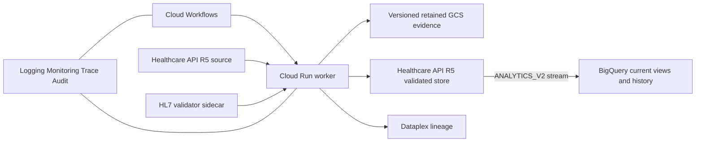

# EMA Flow

EMA Flow is a Google Cloud architecture package that proves deterministic interoperability
between:

1. a published HL7 Global ePI 1.0.0 Type 2 product graph and authoritative SmPC sections;
2. the EMA EU ePI 1.0.0 English CAP SmPC QRD profile chain; and
3. near-real-time analytical records streamed natively from Cloud Healthcare API R5 to
   BigQuery.

It deliberately has no bespoke operations dashboard. Cloud Workflows, Cloud Logging,
Cloud Monitoring, Cloud Trace, Cloud Audit Logs, Dataplex Data Lineage, and BigQuery Studio
are the operator interface.

## What the demonstration proves

- Complete Type 2 graph preflight, including structured product, authorization, package,
  manufactured/administrable product, ingredient, substance, and organization resources.
- Fail-closed conversion of supplied canonical SmPC sections to the exact English CAP QRD
  hierarchy.
- Byte-preservation checks for supplied XHTML; clinical text is never generated or rewritten.
- `ConceptMap`, `StructureMap`, field-level decisions, input/output hashes, validation
  `OperationOutcome`s, and KMS-signed run manifests.
- Validation by both the official HL7 validator and Healthcare API `$validate`.
- Idempotent FHIR transaction writes only after all required validation gates pass.
- Direct `ANALYTICS_V2` streaming from the validated R5 FHIR store to BigQuery. Google
  documents expected lag as typically dozens of seconds; the workflow waits for and records
  when the Bundle view becomes queryable.

This is a prototype and qualification-supporting architecture. It is not regulatory
certification, an EMA submission client, or a validated GxP system.

## Architecture



The document `Bundle` is retained as the exchange artifact. Its entries are also persisted
as top-level resources because BigQuery intentionally omits `Bundle.entry.resource` from its
analytical schema.

See [docs/architecture.md](docs/architecture.md) for trust boundaries, controls, and data flow.

## Local deterministic demonstration

Requirements: Node.js 22.14 or newer.

```bash
npm ci
npm run artifacts:generate
npm run check
npm run demo
```

`npm run demo` needs no Google credentials and uses synthetic, explicitly non-clinical text.
It executes deterministic mapping and local structural gates. Production mode additionally
requires the official validator sidecar and Healthcare API validation.

Start the HTTP service in dry-run mode:

```bash
npm run dev
curl -X POST http://127.0.0.1:8080/v1/runs \
  -H 'content-type: application/json' \
  -d '{"source":"fixture"}'
```

## Google Cloud deployment

Prerequisites:

- a billing-enabled Google Cloud project;
- `gcloud` Application Default Credentials with permission to provision the listed services;
- Terraform 1.16 or newer;
- Cloud Build and Binary Authorization permissions;
- an EU region supported by Cloud Healthcare API and all selected services.

The default is `europe-west4`.

```bash
export GOOGLE_CLOUD_PROJECT="your-project-id"
export EMA_FLOW_ENVIRONMENT="dev"
scripts/gcp/deploy.sh
```

The deployment:

1. creates Artifact Registry and required APIs;
2. runs Cloud Build quality, standards-integrity, provenance, Terraform, and image builds;
3. deploys immutable image digests with Binary Authorization enabled;
4. reconciles the R5 stores and native BigQuery stream through the Healthcare REST API;
5. imports checksum-pinned profile dependencies and profiles; and
6. seeds `Bundle/synthetic-type2-smpc` in the source store.

The REST reconciliation is intentional: Google’s Healthcare API supports R5, but the current
Google Terraform provider still rejects `version = "R5"` during provider-side validation.
The script refuses to substitute R4 and never deletes an existing store. Terraform continues
to own the dataset, IAM, BigQuery, Pub/Sub, Cloud Run, Workflows, evidence, and observability
resources.

### GitHub Actions deployment

The deployment workflow runs for pushes to `main` and can also be started manually. It uses
GitHub's OIDC token with Google Cloud Workload Identity Federation, so no service-account key
is stored in GitHub. Configure these repository variables:

- `GCP_PROJECT_ID`
- `GCP_REGION`
- `GCP_DEPLOY_SERVICE_ACCOUNT`
- `GCP_WORKLOAD_IDENTITY_PROVIDER`

The bootstrapped deployer service account needs
`roles/healthcare.datasetAdmin` for the Healthcare dataset and
`roles/healthcare.fhirStoreAdmin` for the R5 REST reconciler. Its other provisioning roles
depend on the resources in this Terraform configuration. The runtime worker remains separate
and has the narrower `roles/healthcare.fhirResourceEditor` role.

Run the real demonstration:

```bash
gcloud workflows run ema-flow-dev-pipeline \
  --location=europe-west4 \
  --data='{"source":"healthcare-api","bundleId":"synthetic-type2-smpc"}'
```

Terraform outputs direct links to workflow executions and BigQuery Studio.

### Retention lock

Terraform configures versioning and an unlocked evidence retention policy. Bucket Lock is
irreversible and is intentionally a separate administrator action after the retention period,
legal basis, recovery process, and costs are approved:

```bash
gcloud storage buckets update "gs://EVIDENCE_BUCKET" --lock-retention-period
```

Do not run that command for a disposable prototype project.

## Standards and validation

All external packages, examples, and validator binaries are recorded in
[fhir/standards.lock.json](fhir/standards.lock.json). Downloaded artifacts are checksum
verified and excluded from git.

The current normative validation targets are:

- `hl7.fhir.uv.emedicinal-product-info#1.0.0`
- `EUePI#1.0.0`
- `EUEpiList`
- `EUEpiBundle`
- `EUEpiComposition`
- `EUEpiCompositionSmPC`
- `EUEpiCompositionCAP`
- `EUQRD-CAP-template-new-SmPC-en`

The HL7 and EMA examples are regression references, not mapping specifications.

## GxP-ready control posture

The package supports ALCOA+ evidence with correlated run IDs, UTC timestamps, immutable
inputs/outputs, hashes, KMS signatures, Cloud Audit Logs, retained evidence, deterministic
replay, and controlled image provenance. Development, validation, and production are separate
Terraform environments with distinct service identities.

Google Cloud operates under shared responsibility. Intended use, risk assessment, procedural
controls, personnel qualification, electronic signatures, application validation, and final
release approval remain the regulated organization’s responsibility. Cloud Deploy approval is
software change control; it is not a Part 11 or Annex 11 content signature.

## Repository access

Browse: [khs-dev/ema-flow](https://cursor.com/codebase/khs-dev/ema-flow). The repository is
private; visibility can be changed in settings on that page.

```bash
# Install the Origin CLI
curl -fsSL https://downloads.cursor.com/origin/install.sh | sh

# Sign in (also sets up git credentials)
origin auth login

# Clone the repository
origin repo clone khs-dev/ema-flow
```

If `origin` is not found:

```bash
echo 'export PATH="$HOME/.local/bin:$PATH"' >> ~/.zshrc
source ~/.zshrc
```

[Origin CLI documentation](https://cursor.com/docs/origin/cli)
