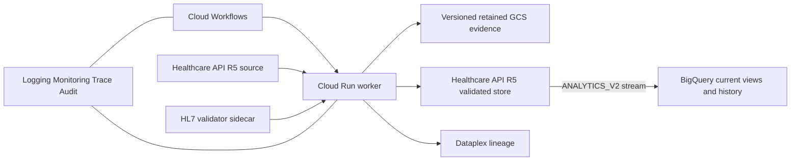

# EMA Flow

EMA Flow is a Google Cloud architecture package that proves deterministic interoperability
between:

1. a published HL7 Global ePI 1.0.0 Type 2 product graph and authoritative SmPC sections;
2. the EMA EU ePI 1.0.0 English CAP SmPC QRD profile chain; and
3. near-real-time analytical records streamed natively from Cloud Healthcare API R5 to
   BigQuery.

It deliberately has no bespoke operations dashboard. Cloud Workflows, Cloud Logging,
Cloud Monitoring, Cloud Trace, Cloud Audit Logs, Dataplex Data Lineage, and BigQuery Studio
are the operator interface.

## What the demonstration proves

- Complete Type 2 graph preflight, including structured product, authorization, package,
  manufactured/administrable product, ingredient, substance, and organization resources.
- Fail-closed conversion of supplied canonical SmPC sections to the exact English CAP QRD
  hierarchy.
- Byte-preservation checks for supplied XHTML; clinical text is never generated or rewritten.
- `ConceptMap`, `StructureMap`, field-level decisions, input/output hashes, validation
  `OperationOutcome`s, and KMS-signed run manifests.
- Validation by both the official HL7 validator and Healthcare API `$validate`.
- Idempotent FHIR transaction writes only after all required validation gates pass.
- Direct `ANALYTICS_V2` streaming from the validated R5 FHIR store to BigQuery. Google
  documents expected lag as typically dozens of seconds; the workflow waits for and records
  when the Bundle view becomes queryable.

This is a prototype and qualification-supporting architecture. It is not regulatory
certification, an EMA submission client, or a validated GxP system.

## Architecture



The document `Bundle` is retained as the exchange artifact. Its entries are also persisted
as top-level resources because BigQuery intentionally omits `Bundle.entry.resource` from its
analytical schema.

See [docs/architecture.md](docs/architecture.md) for trust boundaries, controls, and data flow,
and [docs/roadmap.md](docs/roadmap.md) for what is built and what is planned.

### Zone A hand-off contract

Structuring a label document into the Type 2 graph is a separate, probabilistic Zone A
service; this repository (Zone B) accepts only an approved `CanonicalSubmission`, passed by
reference, and re-verifies it before running the frozen transform and validation pipeline.
A submission is named, never inlined: `POST /v1/runs` takes `{uri, sha256}` into the submission
bucket, and the submission itself names its fidelity report and extracted text. Status: the
contract, the ingress gate, the reference resolver, the `document` route, and the Workflows
`document` branch exist; no Zone A service produces submissions yet, so in practice the only
producer is `src/fixtures/synthetic-submission.ts`. The `fixture` and `healthcare-api` sources
are pre-existing trusted inputs guarded by IAM, not by this gate; the worker's run-source
allowlist (`ENABLED_RUN_SOURCES`, Terraform `enabled_run_sources`, default all three; set
`["document"]` where Zone A is the only producer) disables them. That allowlist is built,
tested (`test/run-sources.test.ts`) and merged into this tree; the Terraform default is still
all three sources, so nothing narrows until an operator sets the variable. See
[docs/adr/0002-two-trust-zones-and-canonical-submission.md](docs/adr/0002-two-trust-zones-and-canonical-submission.md)
and
[docs/adr/0003-mechanical-narrative-fidelity.md](docs/adr/0003-mechanical-narrative-fidelity.md)
for the trust boundary and the mechanical narrative fidelity check. The contract's Zod schemas
are the source of truth; generated JSON Schema is checked into `contracts/generated/` and kept
in sync by `npm run contracts:check`. The golden vectors in `test/fixtures/fidelity/` are the
executable specification for any re-implementation of the fidelity check.

## Local deterministic demonstration

Requirements: Node.js 22.14 or newer.

```bash
npm ci
npm run artifacts:generate
npm run check
npm run demo
```

`npm run demo` needs no Google credentials and uses synthetic, explicitly non-clinical text.
It executes deterministic mapping and local structural gates. Production mode additionally
requires the official validator sidecar and Healthcare API validation.

Start the HTTP service in dry-run mode:

```bash
npm run dev
curl -X POST http://127.0.0.1:8080/v1/runs \
  -H 'content-type: application/json' \
  -d '{"source":"fixture"}'
```

An approved Zone A hand-off is named rather than sent. `SUBMISSION_BUCKET` must be set, the
object must live in that bucket, and the hash must be the SHA-256 of the submission's canonical
JSON (`contracts/generated/run-request.schema.json`):

```bash
curl -X POST http://127.0.0.1:8080/v1/runs \
  -H 'content-type: application/json' \
  -d '{"source":"document","submissionRef":{"uri":"gs://BUCKET/smpc.submission.json","sha256":"<64 hex>"}}'
```

`GET /healthz` reports `documentSource: false` when no submission bucket is configured, and the
route then answers `503 document-source-not-configured` rather than failing obscurely. A source
outside `ENABLED_RUN_SOURCES` answers `422 { "error": "source-disabled" }` before any reader,
fixture, or client is touched.

## Google Cloud deployment

Prerequisites:

- a billing-enabled Google Cloud project;
- `gcloud` Application Default Credentials with permission to provision the listed services;
- Terraform 1.16 or newer;
- Cloud Build permissions;
- an EU region supported by Cloud Healthcare API and all selected services.

The default is `europe-west4`.

```bash
export GOOGLE_CLOUD_PROJECT="your-project-id"
export EMA_FLOW_ENVIRONMENT="dev"
bash scripts/gcp/deploy.sh
```

The deployment:

1. creates Artifact Registry and required APIs;
2. GitHub Actions runs `npm run check` as the Quality gate step before deploy; Cloud Build
   (`cloudbuild.images.yaml`) only builds the worker, validator, and query images; `cloudbuild.yaml` is
   a separate, manual/CI-optional configuration that additionally runs the quality gate,
   standards-integrity check, and Terraform format/validate before building those same images;
3. deploys immutable image digests; Binary Authorization is configurable
   (`enforce_binary_authorization`) and is disabled by default;
4. reconciles the R5 stores and native BigQuery stream through the Healthcare REST API;
5. imports checksum-pinned profile cards and profiles; and
6. seeds `Bundle/synthetic-type2-smpc` in the source store.

The REST reconciliation is intentional: Google’s Healthcare API supports R5, but the current
Google Terraform provider still rejects `version = "R5"` during provider-side validation.
The script refuses to substitute R4 and never deletes an existing store. Terraform continues
to own the dataset, IAM, BigQuery, Pub/Sub, Cloud Run, Workflows, evidence, and observability
resources.

### GitHub Actions deployment

The deploy remote is
[ogbetspp-coder/fhir_real_time_data_exchange](https://github.com/ogbetspp-coder/fhir_real_time_data_exchange).
The workflow runs for pushes to `main` and can also be started from
**Actions → Deploy to Google Cloud → Run workflow**.

It uses GitHub's OIDC token with Google Cloud Workload Identity Federation, so no
service-account key is stored in GitHub. In that repository, set these Actions variables:

| Variable                         | Example                                                                                  |
| -------------------------------- | ---------------------------------------------------------------------------------------- |
| `GCP_PROJECT_ID`                 | your Google Cloud project id                                                             |
| `GCP_REGION`                     | `europe-west4`                                                                           |
| `GCP_DEPLOY_SERVICE_ACCOUNT`     | `ema-flow-deployer@PROJECT_ID.iam.gserviceaccount.com`                                   |
| `GCP_WORKLOAD_IDENTITY_PROVIDER` | `projects/PROJECT_NUMBER/locations/global/workloadIdentityPools/POOL/providers/PROVIDER` |

Three further Actions variables configure who may call the query service. They are variables,
not secrets: an IAM member string, an opaque subject id, a FHIR bundle id, and an OAuth client
id are identifiers, and holding one grants nothing. Each is optional; an unset variable leaves
the Terraform default, and a deploy with all three unset succeeds and authorises no caller.

| Variable                  | Example                                                           | Default when unset |
| ------------------------- | ----------------------------------------------------------------- | ------------------ |
| `QUERY_INVOKERS`          | `user:you@example.com,serviceAccount:a@p.iam.gserviceaccount.com` | `[]`               |
| `QUERY_ENTITLEMENTS_JSON` | `{"112233445566778899000":{"bundles":["synthetic-type2-smpc"]}}`  | `{}`               |
| `QUERY_OAUTH_CLIENT_IDS`  | `32555940559.apps.googleusercontent.com`                          | `[]`               |

`scripts/gcp/deploy.sh` turns the two comma-separated values into Terraform list arguments and
passes the entitlement map through unchanged; it logs byte counts, never values, because the
deploy log is attached to a GitHub issue on failure.

The WIF attribute condition must allow
`repo:ogbetspp-coder/fhir_real_time_data_exchange:ref:refs/heads/main` (or the whole
repository). After the four variables are set, start the workflow from the Actions tab.

The bootstrapped deployer service account needs
`roles/healthcare.datasetAdmin` for the Healthcare dataset and
`roles/healthcare.fhirStoreAdmin` for the R5 REST reconciler. Its other provisioning roles
depend on the resources in this Terraform configuration. The runtime worker remains separate
and has the narrower `roles/healthcare.fhirResourceEditor` role — bound at project level
today (`google_project_iam_member.worker_healthcare` in `infra/security.tf`), whereas the
query service's reader role is bound on the dataset; tightening the worker's binding to the
dataset is listed in `docs/roadmap.md` under "Needs a person".

Run the real demonstration:

```bash
gcloud workflows run ema-flow-dev-pipeline \
  --location=europe-west4 \
  --data='{"source":"healthcare-api","bundleId":"synthetic-type2-smpc"}'
```

Terraform outputs direct links to workflow executions and BigQuery Studio.

### Retention

Retention is a native Cloud Storage policy set from Terraform variables, never application
logic, so each deployment carries the duration its owner requires:

| Bucket      | Variable                    | Default                                        |
| ----------- | --------------------------- | ---------------------------------------------- |
| Evidence    | `evidence_retention_days`   | 2555 days (7 years), minimum 30                |
| Submissions | `submission_retention_days` | 0 — no policy; set to 30 or more to enable one |

Both policies are created unlocked. The submission default is 0 because this is a
demonstrator and a retention policy makes every object in the bucket undeletable until it
expires, which would outlive the demonstration by years; set it per client once they state a
duration.

Bucket Lock is irreversible and is intentionally a separate administrator action, taken only
after the retention period, legal basis, recovery process, and costs are approved:

```bash
gcloud storage buckets update "gs://EVIDENCE_BUCKET" --lock-retention-period
```

Do not run that command for a disposable prototype project.

### Calling the query service

`ema-flow-<env>-query` (`docs/architecture.md`, `docs/design/epi-mcp-query-service.md`) is a
separate Cloud Run deployable from the worker: read-only, its own service account, its own
Terraform variables. It is built and its tests pass (`test/query/`); it has not yet been
deployed to a project. Two things must be granted before it answers anything:

1. **Invocation** — add your principal to `query_invokers` (a Terraform variable, so the grant
   is in version control):
   ```hcl
   query_invokers = ["user:you@example.com"]
   ```
2. **Entitlement** — add your token's `sub` claim to `query_entitlements_json`, keyed by that
   subject. A Google `sub` is an opaque numeric string, never an e-mail address; the service
   rejects a key containing `@` at startup, and the map carries only `bundles` per principal
   (an older map with an `organisation` key also fails startup):
   ```hcl
   query_entitlements_json = jsonencode({
     "112233445566778899001" = { bundles = ["synthetic-type2-smpc"] }
   })
   ```

The service accepts two credential kinds on `Authorization: Bearer`, told apart by shape
(`src/query/auth.ts`):

- a bearer that is three base64url segments is verified as a Google-signed OIDC **ID token**
  for `QUERY_AUDIENCE` (audit `credentialType` = `id-token`) — the path for a user, a service
  account, or the ADK agent;
- anything else is treated as a Google OAuth 2.0 **access token** (audit `credentialType` =
  `access-token`) — the end user's token as Gemini Enterprise forwards it. It is verified
  through Google's tokeninfo endpoint and accepted only when its `aud` or `azp` is listed in
  `query_oauth_client_ids`. With that list empty (the default) every access token is rejected.
  Successful access-token verifications are cached in process memory, keyed by the token's
  SHA-256, for at most 300 seconds and never past the token's own expiry, at most 1,000 entries.

#### Two hostnames, one audience

Cloud Run serves the service on two hostnames, and only one of them is accepted as a token
audience. Three Terraform outputs keep them apart:

| Output               | Value                                                                                                                    |
| -------------------- | ------------------------------------------------------------------------------------------------------------------------ |
| `query_service_url`  | the deterministic `https://ema-flow-<env>-query-<project number>.<region>.run.app` — the endpoint to send requests to    |
| `query_audience`     | the exact string the container receives as `QUERY_AUDIENCE`; equal to `query_service_url` unless `query_audience` is set |
| `query_service_urls` | every URL Cloud Run reports, including the legacy `https://<service>-<hash>-<region code>.a.run.app` hostname            |

Requests to either hostname reach the service. Only `query_audience` is accepted as an ID
token's `aud` (`src/query/auth.ts`), so an ID token minted for the legacy hostname produces a
failure that looks like a service fault: `/healthz`, which the service answers without any
token check of its own, still returns 200, while every `/mcp` call is answered
`401 {"error":"unauthenticated"}`. Mint tokens for `query_audience` and send them to
`query_service_url`.

```bash
SERVICE_URL="$(terraform -chdir=infra output -raw query_service_url)"
AUDIENCE="$(terraform -chdir=infra output -raw query_audience)"
```

That 401 was reproduced in review against the service's verification code. It has not been
observed against a deployed service, because no `terraform apply` has created one; the two
URL shapes above were confirmed on the already-deployed worker in the same project and region.

#### Minting a token

**A service account you can impersonate** — needs `roles/iam.serviceAccountTokenCreator` on it,
and does not switch your active gcloud account:

```bash
TOKEN="$(gcloud auth print-identity-token \
  --impersonate-service-account="ema-flow-query-caller@${GOOGLE_CLOUD_PROJECT}.iam.gserviceaccount.com" \
  --audiences="$AUDIENCE")"

# The subject to entitle is that token's `sub`. Decode the payload without printing the token.
printf '%s' "$TOKEN" | cut -d. -f2 | tr '_-' '/+' | base64 -d 2>/dev/null | jq -r .sub
```

**Your own Google account** cannot mint an ID token for this service at all.
`gcloud auth print-identity-token --audiences=...` answers
`ERROR: (gcloud.auth.print-identity-token) Invalid account type for --audiences. Requires valid service account.`
for a user account, and a user's plain identity token carries gcloud's own OAuth client id as
its audience rather than `QUERY_AUDIENCE`. The path that does work for a human is the
access-token path. Read the client id and the subject gcloud presents:

```bash
curl -s -X POST -H "Authorization: Bearer $(gcloud auth print-access-token)" \
  https://oauth2.googleapis.com/tokeninfo
```

Run from a logged-in user account on 2026-09-20, that returned `aud` and `azp` both
`32555940559.apps.googleusercontent.com`, plus the `sub` to entitle. An operator then sets
three things: that client id in `query_oauth_client_ids`, `user:<your e-mail>` in
`query_invokers`, and that `sub` in `query_entitlements_json`. The token is then
`$(gcloud auth print-access-token)` and needs no audience.

That client id is built into every gcloud installation worldwide, so naming it proves only that
a token came from gcloud and never who presented it. What still stands between such a caller
and a document is Cloud Run's `run.invoker` on the service and the per-subject entitlement —
nothing else. It is `[]` by default; adding it is a deliberate act.

#### Calling it

`GET /healthz` performs no application-level check: it answers
`{ "status": "ok", "service": "ema-flow-query", "version": <QUERY_SERVICE_VERSION> }` from the
process's own configuration, without a token check and without touching the FHIR store, so it
proves the container started and nothing more. Cloud Run's own IAM check still applies to it,
so a bearer token is still required. `$TOKEN` below is either the impersonated ID token above
or `$(gcloud auth print-access-token)`:

```bash
curl -s -H "Authorization: Bearer $TOKEN" "$SERVICE_URL/healthz"

curl -s -X POST "$SERVICE_URL/mcp" \
  -H "Authorization: Bearer $TOKEN" \
  -H "Content-Type: application/json" \
  -H "Accept: application/json, text/event-stream" \
  -d '{
        "jsonrpc": "2.0",
        "id": 1,
        "method": "initialize",
        "params": {
          "protocolVersion": "2025-11-25",
          "capabilities": {},
          "clientInfo": { "name": "curl", "version": "0.0.0" }
        }
      }'
```

`2025-11-25` is `LATEST_PROTOCOL_VERSION` of the pinned `@modelcontextprotocol/sdk` 1.30.0.

What `/mcp` answers before any protocol message is dispatched, in this order
(`src/query/app.ts`):

| Condition                                                        | Answer                                  |
| ---------------------------------------------------------------- | --------------------------------------- |
| No, malformed, or unverifiable bearer                            | `401 { "error": "unauthenticated" }`    |
| Verified principal with no entry in `query_entitlements_json`    | `403 { "error": "not-entitled" }`       |
| Method other than `POST`                                         | `405 { "error": "method-not-allowed" }` |
| `X-Query-Turn-Id` present but not a UUID                         | `400 { "error": "invalid-request" }`    |
| Body not JSON, or larger than 4 MiB                              | `400 { "error": "invalid-request" }`    |
| JSON-RPC batch of more than 8 messages                           | `400 { "error": "invalid-request" }`    |
| Two entries carrying the same JSON-RPC id                        | `400 { "error": "invalid-request" }`    |
| A `notifications/cancelled` naming a request id in the same body | `400 { "error": "invalid-request" }`    |

The last two are refused because the transport would not answer those bodies as one response
per request id, and the request would never finish. Past that point the service waits at most
30 seconds for the transport, and stops sooner if the client disconnects; on either bounded end
it answers `503 { "error": "unavailable" }` and writes the outstanding audit records itself.

The `401` line logged carries nothing derived from the credential; the `403` line carries the
principal (the `sub` an operator would entitle). Inside the protocol, a document outside the
caller's entitlement is `document-not-found` from every tool — `not-entitled` is an audit
outcome only, never a returned error code. `find_product` reads at most the first 200 entitled
Bundle ids (8 reads in flight) and answers `truncated: true` whenever the caller's entitlement
holds more documents than the call searched — because the horizon cut the list, because `limit`
stopped the scan, or because the request's read budget ran out — so an empty `products` with
`truncated: true` is not "no such product". One HTTP request may make 400 store reads across
its whole JSON-RPC batch; past that, `find_product` stops scanning and every other tool answers
`unavailable` rather than reading. That is a per-request bound and not a per-principal quota.

`X-Query-Turn-Id`, when present and a UUID, is copied into every audit record of the request
as `turnId`; the agent sends it on every request of a turn so its own `AgentTurnRecord` can be
joined to the service's records.

`QUERY_AUDIENCE` defaults to Cloud Run's deterministic URL
(`https://ema-flow-<env>-query-<project number>.<region>.run.app`), which is known before the
service exists, so no bootstrap apply is needed; a Terraform postcondition fails the apply if
that URL is not one Cloud Run reports for the service. This has been checked by `terraform
validate` only, not by an apply against a project.

Query-service Terraform variables beyond `query_invokers`, `query_entitlements_json`, and
`query_oauth_client_ids` — those three `scripts/gcp/deploy.sh` passes from the Actions
variables above; supply the rest through `TF_VAR_<name>` or an `infra/*.auto.tfvars` file:

| Variable                          | Default   | Effect                                                                                                                      |
| --------------------------------- | --------- | --------------------------------------------------------------------------------------------------------------------------- |
| `query_oauth_client_ids`          | `[]`      | OAuth 2.0 client ids whose access tokens are accepted (`QUERY_OAUTH_CLIENT_IDS`); the env var is omitted when empty         |
| `query_audience`                  | `""`      | Empty means the deterministic URL above; set only to front the service with another hostname                                |
| `service_version`                 | `"local"` | `QUERY_SERVICE_VERSION` in every audit record; `deploy.sh` passes the commit SHA                                            |
| `query_image`                     | —         | Must be an image reference by digest when the service is planned; the digest part becomes `IMAGE_DIGEST` in every record    |
| `alert_notification_email`        | `""`      | The entitlement-denial log metric always exists; the e-mail channel and alert policy (> 5 denials in an hour) only when set |
| `lock_regulated_audit_log_bucket` | `false`   | Locks the retained audit log bucket. Irreversible: retention cannot then change and Terraform will not unlock it            |

The metric filter and the alert threshold have been checked by `terraform validate` only; no
plan or apply has run against a project.

### Deploy order before the first demonstration

Do these three in this order. The order matters because of one change in this branch: the
worker's Provenance projection now writes the approver's role on the attester agent
(`src/fhir/provenance.ts`, `APPROVER_ROLE_SYSTEM`), and `get_provenance` reads only that coding
and never infers it. Every document already in the demonstrator's validated store was written
by a worker built before that change, so its persisted `Provenance` carries no role — and
`get_provenance` answers `unavailable` for all of them, with nothing to indicate the cause but
this paragraph.

1. **Deploy the worker** from this branch, so the projection that writes the role is running.
2. **Re-ingest the documents** through the ordinary document path: `npx tsx scripts/demo/seed.ts`
   (rehearse with `--dry-run`). That writes a second `Provenance` resource for the document —
   its id is derived from the submission id (`stableUuid("ingestion-provenance", submissionId)`),
   so a re-ingest adds one rather than replacing the old one.
3. **Deploy the query service**, then call `get_provenance` for the document you intend to show
   and confirm it answers an approver role before anyone is in the room. Confirming it is not
   optional: `get_provenance` resolves the resource with
   `Provenance?target=Bundle/<id>&_count=1` and no `_sort` (`src/query/fhir-reader.ts`), so
   which of two Provenance resources for the same document it returns is not fixed by this
   code. A fresh store, or a fresh document id, avoids the ambiguity entirely.

Nothing here is a data migration: a `Provenance` already written is never rewritten, and this
repository has no tool that would rewrite one.

## Standards and validation

All external packages, examples, and validator binaries are recorded in
[fhir/standards.lock.json](fhir/standards.lock.json). Downloaded artifacts are checksum
verified and excluded from git.

The current normative validation targets are:

- `hl7.fhir.uv.emedicinal-product-info#1.0.0`
- `EUePI#1.0.0`
- `EUEpiList`
- `EUEpiBundle`
- `EUEpiComposition`
- `EUEpiCompositionSmPC`
- `EUEpiCompositionCAP`
- `EUQRD-CAP-template-new-SmPC-en`

The HL7 and EMA examples are regression references, not mapping specifications.

## Control posture supporting GxP qualification

The evidence model makes each run attributable (one run id propagated through logs, evidence
objects, the ledger, and the FHIR transaction), timestamped in UTC, and hash-bound (SHA-256 of
inputs and outputs, a KMS-signed manifest, retained evidence objects, Cloud Audit Logs,
deterministic replay, and digest-pinned images). It does not claim ALCOA+ or any other
data-integrity standard; whether the evidence meets one is an assessment the owning
organisation makes. Development, validation, and production are separate Terraform
environments with distinct service identities.

Google Cloud operates under shared responsibility. Intended use, risk assessment, procedural
controls, personnel qualification, electronic signatures, application validation, and final
release approval remain the regulated organization’s responsibility. Deployment today is an
unattended `terraform apply` from GitHub Actions after the quality gate; a human promotion
gate (GitHub environment approval or Cloud Deploy) is software change control the owning
organization adds, and it is not a Part 11 or Annex 11 content signature.

## Repository access

The repository is
[github.com/ogbetspp-coder/fhir_real_time_data_exchange](https://github.com/ogbetspp-coder/fhir_real_time_data_exchange)
(private). Clone it with git over HTTPS, or with the GitHub CLI installed from your platform's
package manager — no `curl | sh` installer is used or recommended here:

```bash
git clone https://github.com/ogbetspp-coder/fhir_real_time_data_exchange.git
# or, with gh installed from a package manager (brew install gh / apt install gh):
gh repo clone ogbetspp-coder/fhir_real_time_data_exchange
```
