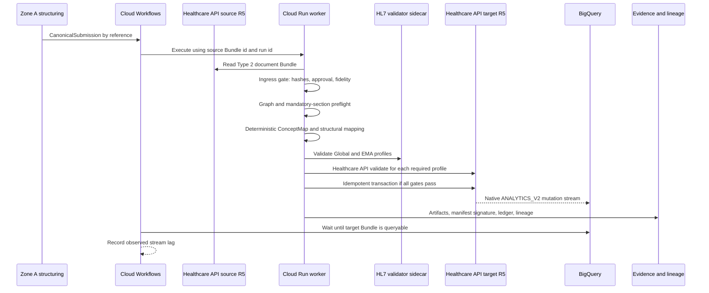

# EMA Flow architecture

## Strategic decision

The enterprise interchange baseline is the published HL7 Global ePI 1.0.0 profile plus a
Type 2 product graph; an authority's published ePI enters as a Type 1 record (ADR 0001's
amendment, ADR 0005). EMA EU ePI is a jurisdictional output contract. Neither preview or
trial-use profile is treated as a permanent internal master-data schema.

EMA-only organizations could author directly against EMA profiles. This architecture retains
a narrow canonical boundary because its purpose is to prove multi-jurisdiction interoperability.

## Zone A structuring boundary

Converting an authored label document into the Type 2 graph is not fully deterministic:
locating section boundaries, metadata, and codes requires judgement, today delivered by
AI-assisted extraction with human review. ADR 0002 and ADR 0003 split that concern into two
trust zones enforced mechanically rather than by instruction.

Zone A (a separate, probabilistic service) proposes section boundaries, metadata, and codes
from an approved source document; it may never author, alter, reorder, or omit narrative
words, and every code it assigns must cite a terminology lookup. Its output is a
`CanonicalSubmission` proposal, passed by reference, until a human approves it. An approved
submission is written to the submission bucket and named to `POST /v1/runs` as
`{uri, sha256}`; `src/gcp/submission-reader.ts` resolves that pointer and the two it contains
(fidelity report, extracted text), reading only from the configured bucket, capping object
size, and hash-checking every part. Status: the contract (`CanonicalSubmission` 2.0.0), the
ingress gate, the reader, the `document` route, and the Workflows `document` branch exist; no
Zone A service produces submissions yet. The producers are `src/fixtures/synthetic-submission.ts`
(a synthetic drawn document) and, for an authority's published ePI,
`scripts/authority/import.ts` (below). No drawn-document extractor is qualified
(`docs/fidelity-normalization.md` §7), so the gate accepts a drawn submission only as a
synthetic one, where the deployment sets `ALLOW_SYNTHETIC_SOURCES`.

The `fixture` and `healthcare-api` sources are pre-existing trusted inputs guarded by IAM, not
by this gate. The worker's run-source allowlist (`ENABLED_RUN_SOURCES`, Terraform
`enabled_run_sources`; a request for a source outside it answers `422 source-disabled` before
any reader, fixture, or client is touched) follows `ALLOW_SYNTHETIC_SOURCES` (default false in
`src/config.ts` and in Terraform): with the flag off, only `document` is enabled and enabling
either ungated source fails startup (Terraform refuses the two variables disagreeing); with it
on, all three are enabled unless the allowlist says otherwise. The `dev` deploy sets the flag.
Either way the ungated sources cannot write into an authority import's resources: every id a run
persists derives from its source Bundle's identifier value, and only the importer may use the
reserved `authority-import:` namespace (`test/namespace.test.ts`). Zone B (this repository,
deterministic) accepts only an approved `CanonicalSubmission`, re-verifies hash, approval,
bijection, and terminology invariants at ingress, and only then runs the transform, validation,
persistence, and evidence pipeline. The transform and preflights changed once for authority
imports (ADR 0002's amendment: re-identified entries, the Type 1 preflight, permitted headings,
the List's product identity); they remain deterministic, and the mapping and generated
artifacts are versioned as before.

The engine that will produce submissions from real labels (roadmap item 8) has its first
component in `zone-a/`: a Word reader that refuses what it cannot read exactly, and the QRD
template registry (`qrd/registry/`), the EMA's SmPC template 10.4 and Appendices I–III as data
derived from the EMA's own files, pinned by hash in `qrd/sources.lock.json`
(`docs/design/qrd-registry.md`). Nothing in Zone B reads the registry yet.

Narrative fidelity is checked mechanically, not by prompt: a pure verifier
(`src/fidelity/`) recomputes provenance-span hashes, applies the versioned normalisation in
`docs/fidelity-normalization.md`, and requires an exact match before Zone B will transform a
document source. The `CanonicalSubmission` contract (`src/contracts/`) is Zod-first, with
generated JSON Schema checked into `contracts/generated/` and drift caught by
`npm run contracts:check`. On the `document` route — the only route that accepts Zone A output
— nothing reaches the FHIR store or the evidence bucket without a hash-bound human approval and
a passing fidelity check; the `fixture` and `healthcare-api` routes are not covered by that
gate and rest on IAM and the run-source allowlist instead. UR-09 through UR-16 in
`docs/validation/README.md` trace these controls to tests. See ADR 0002 and ADR 0003 for the
full invariant list and versioning rules.

### Authority imports

An authority's published ePI (ADR 0005; `docs/design/authority-import-contract.md`) takes its
own path to the same gate. A person requests the import, naming the authority, the document, the
List that indexes it and the language: that request is the human decision for an import. The
producer, `scripts/authority/import.ts`, fetches the document Bundle and the List, runs the
importer (`src/authority/`, shared pure TypeScript, ADR 0004's amendment) and writes the
submission, its page text (one page per section) and its fidelity report. The producer's
identity is not trusted: for a submission whose source is an `authority-publication`, the worker
fetches both files itself (for the EMA, a fixed URL template on `epi.ema.europa.eu`, one `Accept`
header, no redirect, HTTP 200 only, 30 seconds, 4 MiB), requires the pinned hash and length, runs
the importer its own build contains on those bytes, and accepts only the identical submission,
page text and report before the ordinary gate runs.

The record is a Global ePI Type 1 graph: one Composition, MedicinalProductDefinition,
Organization and RegulatedAuthorization, every value from the document or the List or a stated
rule; packs, ingredients and substances are declared not supplied. Its approval is
`authority-publication`: the publication it names, with `authorityStatus: pilot`, and who
requested the import (`requestedBy`, a placeholder until roadmap item 2). A synthetic authority,
in the EMA's live form with ids in a reserved block, is built by `src/authority/synthetic.ts`
and served only where synthetic sources are allowed.

Until roadmap 3a PR 5 an import runs only as a dry run: the gate refuses an authority import when
`DRY_RUN` is false, so nothing it makes is persisted, entitled to the query service or seen by
the agent. PR 2's importer carries no picture and removes no presentation (ADR 0005's
amendment), so each of the four real labels pinned in `labels/ema-epi/` is refused at a recorded
stage (`test/fixtures/authority/vectors.json`).

## Deterministic data flow



An authority import (dry run only until roadmap 3a PR 5) reaches the same worker with one more
step at the gate:

```mermaid
sequenceDiagram
  participant P as Producer (scripts/authority/import.ts)
  participant AU as Authority ePI API
  participant APP as Cloud Run worker

  P->>AU: GET document Bundle and List
  P->>P: Import: request + bytes to submission, pages, report
  P->>APP: CanonicalSubmission by reference
  APP->>AU: GET the same two files (fixed template, no redirect)
  APP->>APP: Require pinned hashes; re-run the importer; require the same submission
  APP->>APP: Ingress gate, Type 1 preflight, crosswalk, EMA preflight
  APP-->>APP: validated, nothing persisted (DRY_RUN)
```

The transformer accepts two authoritative source categories:

- the structured product graph (Type 2, or for an authority import the Type 1 record); and
- an authored canonical SmPC Composition with stable section identifiers.

The source preflight is `validateCanonicalPreflight(bundle, graphType)`: Type 2 as strict as
ever, Type 1 exactly one Composition, MedicinalProductDefinition, Organization and
RegulatedAuthorization, linked, named and identified. The graph type is the submission's, and
the ungated sources are always Type 2.

It does not infer clinical narrative from ingredients or product properties. Every output
field is classified as copied, code-mapped, structurally moved, deterministically defaulted,
or rejected. Missing and duplicate required sections are errors. The crosswalk
(`transformType2ToEma`) also refuses, with one issue each, a source it would otherwise have to
drop from or rearrange:

- a section coded in the manifest's source code system that no rule maps, at any depth; a
  section carrying two such codes; a section with no `code` element;
- a section without such a code whose `text.div` shows any text, or that the fidelity XHTML
  scanner (`src/fidelity/xhtml.ts`) cannot read;
- a mapped section that is not directly under the section its parent rule maps (the root rule
  at the top level), or that comes before a sibling the manifest orders first;
- a section carrying any element besides `id`, `title`, `code`, `text` and `section` (for
  example `entry`, `extension`, `emptyReason`, `author`, `focus`, `orderedBy` or `mode`);
- a mandatory leaf section, or a section whose rule is marked `"narrative": "required"`
  (4.8, whose own text sits above its reporting subsection), without narrative that the
  scanner can read and that shows some text;
- a source Composition or Bundle whose `language` is missing or is not an English BCP 47 tag
  (`en`, optionally `-Latn`, optionally a region);
- a source Bundle without `identifier.value`, and a reference in any entry that names no entry
  of the Bundle (relative, versioned, `#contained` or external); a reference by identifier alone
  is kept.

Every id the run persists derives from the source Bundle's identifier value: the EMA List,
Bundle and Composition as before, and each copied entry
`stableUuid("ema-entry:" + resourceType, identifierValue + ":" + position)` with a `urn:uuid`
fullUrl, its references rewritten to match; a reference naming no entry refuses, and so does
a source Bundle or entry element the crosswalk does not carry (a signature, an entry's request),
a `meta` element on any resource but `versionId`, `lastUpdated` and `profile` (an extension, a
tag, a source), and a contained resource or implicit rules on any resource; the output's `meta`
is its profile alone. A run therefore writes only into its own namespace, and every
`Reference.reference` it persists names its own output, whatever ids its source chose
(`test/namespace.test.ts`). Other address-like values a source writes (a Composition's `url`, an
extension's `valueUri`) are carried as written, a stated residual: no route that is not synthetic
can reach the crosswalk with one today, since a drawn source must be synthetic and an import
builds its own record.

Some things it still does without asking, by design: every mapped section takes a new id and, as its
heading, the source's heading when the rule permits it (the rule's `title` or one of its
`alternativeTitles`, the QRD template's forms without optional wording, mapping 1.3.0) and otherwise
the rule's `title`; only the target coding is kept; the EMA List is titled by the product's name
(the document's title only where the graph names no product) and carries the holder, regulatory
agency and procedure number the graph states in their identifier systems, never a value it does not;
Composition.language and Bundle.language are written as `en`; and a section without a source code
and without narrative — an empty container — is dropped, title included. The `xml:lang` of a
narrative `div` is not checked yet. The manifest loader rejects a manifest in which two rules share
a `sourceKey` or a `targetCode`, and lineage names the mapping by the version the loaded manifest
declares, the same `mappingVersion` the run manifest records.

## Validation model

Validation is deliberately redundant:

0. for document sources, `docs/fidelity-normalization.md` defines the mechanical narrative
   fidelity check that gates ingress before any transformation (ADR 0003);
1. application checks verify graph completeness, uniqueness, and expected profiles for the
   submission's graph type (`src/fhir/preflight.ts`), and the crosswalk (`transformType2ToEma`)
   refuses a source whose coded sections are not in the manifest's hierarchy and order, as
   listed above; the EMA preflight then checks every target section's code and permitted title
   at its position;
2. the official HL7 Java validator evaluates the pinned packages, FHIRPath, slicing, and
   profile chain;
3. Cloud Healthcare API `$validate?profile=` verifies each profile as deployed in the target
   store; and
4. a write is attempted only when all required outcomes contain no `fatal` or `error` issue.

The target store does not enable implementation-guide enforcement globally. Cloud Healthcare
API considers a resource valid when it matches any enabled global profile, whereas this
pipeline requires the Composition to satisfy all selected EMA profiles. Explicit profile-by-
profile validation is therefore the stronger gate.

## BigQuery synchronization

The validated store’s native `streamConfigs` is the synchronization mechanism. There is no
custom ETL hop between FHIR and BigQuery. The stream is configured for
`ANALYTICS_V2`, daily `meta.lastUpdated` partitions, all ePI business resource types, and
resource history.

Cloud Healthcare API supports R5, but the current first-party Google Terraform provider still
rejects R5 during provider-side validation. Terraform owns the Healthcare dataset and all
surrounding permissions/destinations. A reviewed, idempotent REST reconciler creates or patches
the two stores, verifies that every existing store is R5, refuses any R4 substitution, and does
not delete stores. This limitation and the reconciler output are part of deployment evidence.

Cloud Healthcare API creates one history table and current-state view per resource type.
Google documents expected stream lag as typically dozens of seconds. Workflows queries the
current `Bundle` view every ten seconds for up to two minutes and records the observed upper
bound. An absent row fails the workflow while preserving the successful FHIR write evidence.

`Bundle.entry.resource` is not exported in analytical schemas because it can hold every FHIR
resource type and exceed BigQuery column limits. The write transaction therefore stores every
document entry as a top-level FHIR resource in addition to the immutable document Bundle.

## Evidence and observability

Every run receives one UUID propagated as:

- Workflow execution input;
- structured application log `runId`;
- Healthcare API `X-Request-Id`;
- evidence object prefix;
- BigQuery ledger key;
- lineage run request ID; and
- transaction identifier.

Every run writes the following objects under `runs/<runId>/` in the evidence bucket:
`source-type2`, `ema-list`, `ema-document-bundle`, `mapping-decisions`, `validation-outcomes`,
`signed-manifest`, `lineage-resources`, and, for document sources,
`canonical-submission`, `ingestion-provenance`, `fidelity-report`, and `provenance-resource`.
`source-type2`, `ema-list` (it carries the product name and identifiers, no narrative),
`ema-document-bundle`, and
`canonical-submission` contain the narrative XHTML — the evidence bucket, the submission
bucket, and the FHIR store are the only places narrative rests — while `fidelity-report`,
`ingestion-provenance`, `provenance-resource`, the signed manifest, and the BigQuery ledger row
never do. FHIR payloads and narrative are not written to Cloud Logging.

The signed manifest is `RunManifest` 2.0.0 (1.0.0 and 1.1.0 stay readable). A `document` run's
ingestion block records the source kind (`drawn` or `authority-publication`), the graph type,
whether the deployment accepted synthetic content (`allowSyntheticSources`), the approval as
either union member, and, for an authority import, the importer version and each file the gate
fetched (URL, SHA-256, length, fetch time). The FHIR Provenance's id derives from the source
identifier value and the submission id, one per approval; its targets are the record's
identifier and the output's `Composition/<id>` and `Bundle/<id>`. An import's Provenance has
activity `authority-import`, the authority as agent of its source files, the requester as
`enterer`, and `recorded` at the gate's fetch time. While imports run dry none of this is
written for one; the design keeps the fetched bytes as evidence and re-verifies a recorded import
from them (`scripts/authority/verify-import.ts`, which reads no network) once imports persist.

The signed manifest's `runtime` block ties a run to what produced it: `sourceCommit` is the
deployed git commit (`GIT_COMMIT`, the same `service_version` the query service records),
`imageDigest` is the digest of the worker image (`IMAGE_DIGEST`), both set on the worker by
`infra/run.tf` since 2026-09-22 (`test/infra/worker-provenance.test.ts`); manifests signed before
that record `development` for both. `workflowRevision` is the Cloud Run revision (`K_REVISION`):
the workflow's own revision cannot be passed to the worker without a Terraform dependency cycle.

Cloud Monitoring presents throughput, failures, validation rejections, service latency,
workflow executions, and architectural guidance. Data Access audit logging is enabled for
Healthcare API, Storage, BigQuery, and KMS and routed to a retained regional log bucket.

After a successful `terraform apply`, `scripts/gcp/deploy.sh` reads the effective IAM policy
held by the worker, query and caller service accounts — at project level and on the Healthcare
dataset — prints it into the deploy log and copies it to
`gs://<evidence bucket>/deploy-evidence/<YYYY>/<MM>/<DD>/<UTC stamp>-<environment>-<commit>/`.
This is what closes the gap between the Terraform-declared role set a test asserts and the
policy actually in force (ADR 0004, decision 5). Every step of it is warning-only: a denied
`get-iam-policy`, a missing output, or a failed upload prints a `::warning::` naming the
permission needed and never fails the deploy, so an absent export is visible rather than
silent. The caller account's two exports are expected to come back empty — its only declared
binding is `run.invoker` on one Cloud Run service, which neither policy covers — and that
emptiness is the evidence that it holds nothing else. It runs on every deploy of `dev`; the
exports are under `gs://…-dev-evidence/deploy-evidence/`, the latest for commit `caa5d9a`.

## Security boundaries

- Cloud Run requires IAM authentication on both services; no `allUsers` invoker is granted
  anywhere. On the worker, `run.invoker` is held by two service accounts: the Workflows
  account (`workflow_invoker`) and the deployer, for the post-deploy smoke run
  (`deployer_invoker`, `infra/run.tf`). On the query
  service, `run.invoker` is granted to the members listed in the `query_invokers` variable,
  which is empty by default, plus one service account the configuration creates for the
  purpose: `ema-flow-caller-<env>` (`google_service_account.caller`, `infra/query.tf`). That
  account exists only to be impersonated — a human cannot mint a Cloud Run ID token with their
  own Google account — and holds `run.invoker` on the query service and nothing else. Who may
  mint tokens as it is the `query_token_creators` variable, bound as
  `roles/iam.serviceAccountTokenCreator` on that one account and empty by default. A deploy
  that sets neither variable authorises no caller: the account exists and nobody can use it.
- The worker uses a dedicated service account with the narrow
  `roles/healthcare.fhirResourceEditor` role plus evidence-object, ledger-writer,
  lineage-editor, logger, and signing permissions. That editor role is bound on the record
  dataset only (`google_healthcare_dataset_iam_member.worker_fhir_editor`, `infra/security.tf`),
  as the query service's reader role is; the project-level binding was removed on 2026-09-21
  (`docs/foundations.md`, C4; `test/infra/worker-identity.test.ts`).
- The external deployment identity uses `roles/healthcare.datasetAdmin` and
  `roles/healthcare.fhirStoreAdmin` for Healthcare provisioning; it is not used at runtime.
- Workflows can invoke the worker and query only the FHIR analytics dataset.
- The Cloud Healthcare service agent can publish change notices and edit only the analytics
  dataset.
- No credentials are built into images or stored in the repository.
- Binary Authorization is configurable via `enforce_binary_authorization` and is disabled for
  the prototype; SLSA provenance and SBOM generation are not yet configured.
- Production should use separate projects, organization policies, VPC Service Controls,
  Assured Workloads where applicable, Access Transparency/Approval, and approved CMEK/HSM
  policies.

## Query service

`ema-flow-<env>-query` (ADR 0004, `docs/design/epi-mcp-query-service.md`, whose "Phase 1 as
built" section is the authoritative description) is a second, discrete Cloud Run deployable,
not a mode of the worker. It is tested under `test/query/` and deployed in `dev` as
`ema-flow-dev-query` (europe-west4): first on 2026-09-20, all four tools answered live on
2026-09-21, and redeployed from `main` by every deploy since.

- **Intended use.** A read-only Model Context Protocol endpoint (four tools: `find_product`,
  `get_section`, `get_provenance`, `verify_quote`; contract `query-tools` 2.0.1) that lets an
  AI assistant answer questions about product information with verifiable answers: every
  result names the FHIR resource and version it came from and carries the hashes needed to
  check it against the store without trusting the service.
- **Identity and image.** Its own service account, `ema-flow-query-<env>`, holds exactly two
  roles: `roles/healthcare.fhirResourceReader` on the Healthcare dataset (not the project) and
  `roles/logging.logWriter` on the project. No write role, no bucket, no BigQuery, no KMS
  access. `test/query/acceptance.test.ts` ("least privilege, proven") reads every `infra/*.tf`
  and asserts that role set. Its image (`Dockerfile.query`, the `query` path of the shared
  Artifact Registry repository) pins both stages to the same Node digest as the worker;
  `npm run images:check` fails any root `Dockerfile*` without a digest or with a digest that
  differs. `query_image` must be a by-digest reference when the service is planned; the digest
  part becomes `IMAGE_DIGEST`.
- **Authentication.** Cloud Run requires authentication at the edge (no `allUsers` invoker;
  invocation is per caller through `query_invokers` and the caller service account described
  under "Security boundaries"), and the service verifies the credential
  again itself, so the edge is not trusted alone. Two kinds arrive on `Authorization: Bearer`,
  distinguished by shape: a JWT-shaped bearer is verified as a Google-signed OIDC ID token for
  `QUERY_AUDIENCE` (`credentialType` `id-token`); any other bearer is treated as a Google
  OAuth 2.0 access token, verified through Google's tokeninfo endpoint and accepted only when
  its `aud` or `azp` is in `QUERY_OAUTH_CLIENT_IDS` (`credentialType` `access-token`; with the
  list empty, which is the default, every access token is rejected). Successful access-token
  verifications are cached in process memory — keyed by the token's SHA-256, holding principal
  and expiry only, at most 300 s and never past the token's expiry, at most 1,000 entries,
  failures never cached. `QUERY_AUDIENCE` defaults to the deterministic Cloud Run URL
  (`https://ema-flow-<env>-query-<project number>.<region>.run.app`); a Terraform postcondition
  asserts after apply that the URL is one the service serves. Cloud Run also serves the service
  on a legacy `https://<service>-<hash>-<region code>.a.run.app` hostname. Both hostnames reach
  the service and only the audience string is accepted as an ID token's `aud`, so the outputs
  keep them apart by name: `query_service_url` (where to send requests) and `query_audience`
  (what to mint tokens for) are the same string unless `var.query_audience` overrides it, while
  `query_service_urls` lists every hostname and is not an audience.
- **Answers before the protocol** (`src/query/app.ts`, in this order): `401 unauthenticated`
  for a missing or unverifiable bearer; `403 not-entitled` for a verified principal with no
  entry in the entitlement map, so an authenticated stranger never reaches `tools/list`;
  `405` for a non-`POST`; `400 invalid-request` for an `X-Query-Turn-Id` that is present but
  not a UUID, for a body that is not JSON or exceeds 4 MiB, for a JSON-RPC batch of more than
  8 messages, for two entries carrying the same JSON-RPC id, and for a body carrying a
  `notifications/cancelled` that names a request id in the same body. Nothing is dispatched on
  any of these paths. The last two shapes are refused because the transport would not answer
  them as one response per request id. Past that point the service bounds its own wait at 30
  seconds and on the client's disconnect, answering `503 unavailable` and writing the
  outstanding audit records itself rather than holding a request slot to the Cloud Run timeout.
- **Entitlements.** A Terraform-managed map, `{"<sub>": {"bundles": [...]}}`, parsed once at
  startup with a strict schema (an `organisation` key or an e-mail-shaped principal fails
  startup) and resolved once per request before any store read. Inside the protocol, a document
  outside the caller's entitlement is `document-not-found` from every tool; `not-entitled` is an
  audit outcome, never a returned error code. `find_product` reads at most the first 200
  entitled ids in entitlement order through a pool of 8, stops launching reads once `limit`
  matches are in hand, and reports `truncated: true` whenever the answer is shorter than the
  entitlement holds — documents left unsearched (the horizon or an exhausted read budget) or
  matches dropped by the limit — in the result and in the audit record. One HTTP request may make 400 store reads across its
  whole batch; past that `find_product` stops scanning and every other tool answers
  `unavailable` without reading. It is a per-request bound, not a per-principal quota.
- **What it must never do.** Write, amend, draft, rewrite, or summarise regulated narrative;
  return narrative without its hash; disclose a document outside a caller's entitlement.
- **`/readyz` (and `/healthz`).** Answers `status`, `service`, and `version` from the process's
  configuration only; it performs no token check of its own (Cloud Run IAM still applies),
  calls no store, and reads nothing at request time. It proves the container is up, not that
  the store is reachable. Call `/readyz` from outside: `/healthz` is the container's startup
  probe, and Google's frontend answers that exact path on a `*.run.app` hostname itself without
  forwarding it, so its 404 means nothing.
- **Audit.** One `QueryAuditRecord` (`src/contracts/query-tools.ts`) per dispatched `tools/call`
  request: `service` (`ema-flow-query`), `serviceVersion`, `imageDigest`, `at`, `principal`,
  `credentialType`, `tool`, `argumentsSha256`, `outcome`, `resultCount`, `truncated`
  (`find_product` only), `durationMs`, `bundleId`, `versionId` (the version actually read;
  absent when nothing was read), and `turnId` (when the caller declared one) — never narrative,
  never an argument value. A request the transport refused before the handler ran still gets one
  `invalid-request` record; a notification (no JSON-RPC id) gets none. When the service gives up
  waiting it writes the outstanding records itself — `unavailable` for a call that reached a
  handler and had not finished — and a tool finishing later adds no second record. Records go
  through the same logger as the worker; `credentialType` is on that logger's allow-list
  (`src/lib/logger.ts`, a shared library under ADR 0004 change control), so the written line
  carries every field of the record, and a test parses a written line back against
  `QueryAuditRecordSchema`.
- **Structured lines and alerting.** Every line carries `service: "ema-flow-query"`. The 401
  line is `stage: "query-http", event: "unauthenticated"` with nothing derived from the
  credential; the 403 line adds `principal`. A log-based metric
  (`ema_flow/query_entitlement_denials`) counts lines with `outcome` or `event` equal to
  `not-entitled`; an e-mail channel and an alert policy (more than 5 denials in a rolling hour)
  exist only when `alert_notification_email` is set. The retained audit log bucket can be
  locked with `lock_regulated_audit_log_bucket` (irreversible; default `false`, not set).
- **Turn correlation.** The ADK agent (`agent/`) generates a UUID when a turn starts, sends it
  as `X-Query-Turn-Id` on every request of the turn, and writes it as `turnId` in its own
  `AgentTurnRecord` (contract `agent-turn` 1.0.0), so the two records join on that value
  without either carrying a word of what was asked or answered.

## Scale and failure behavior

Each document is an independent, idempotent run. Workflows provides retries and execution
history; Cloud Run scales horizontally with conservative concurrency because the validator
sidecar is memory intensive. Large payloads belong in the evidence bucket and are represented
in orchestration by identifiers and hashes.

The initial API is synchronous to make the architectural proof inspectable. Higher-volume
submission should publish document IDs to Pub/Sub and start executions through Eventarc.
Bulk historical conversion can reuse the pure mapping library from Dataflow without changing
profiles, evidence schemas, or validation rules.

## Known limitations

- EMA EUePI 1.0.0 is a preview and HL7 Global ePI 1.0.0 is trial-use.
- The synthetic SmPC is not medical advice or authorized product information.
- Terminology validation runs offline in the validator sidecar (`-tx n/a`) for reproducibility;
  required external terminology checks need an approved, versioned terminology service.
- Human content approval and regulated electronic signature are future control boundaries.
- An authority import trusts the authority's HTTPS server at gate time (it serves no
  signature); the EMA calls its ePI service a pilot, so an import carries `authorityStatus:
pilot` and an EMA outage refuses the run. Imports are dry-run only until roadmap 3a PR 5
  (`docs/design/authority-import-contract.md`, "Stated residuals").
- The FHIR store’s stream does not backfill resources written before streaming was enabled.
- This repository cannot establish organizational SOPs, training, supplier qualification, or
  validated state by itself.
