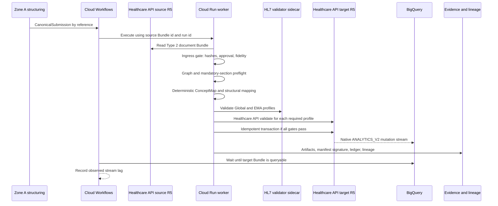

# EMA Flow architecture

## Strategic decision

The enterprise interchange baseline is the published HL7 Global ePI 1.0.0 profile plus a
Type 2 product graph. EMA EU ePI is a jurisdictional output contract. Neither preview or
trial-use profile is treated as a permanent internal master-data schema.

EMA-only organizations could author directly against EMA profiles. This architecture retains
a narrow canonical boundary because its purpose is to prove multi-jurisdiction interoperability.

## Zone A structuring boundary

Converting an authored label document into the Type 2 graph is not fully deterministic:
locating section boundaries, metadata, and codes requires judgement, today delivered by
AI-assisted extraction with human review. ADR 0002 and ADR 0003 split that concern into two
trust zones enforced mechanically rather than by instruction.

Zone A (a separate, probabilistic service) proposes section boundaries, metadata, and codes
from an approved source document; it may never author, alter, reorder, or omit narrative
words, and every code it assigns must cite a terminology lookup. Its output is a
`CanonicalSubmission` proposal, passed by reference, until a human approves it. An approved
submission is written to the submission bucket and named to `POST /v1/runs` as
`{uri, sha256}`; `src/gcp/submission-reader.ts` resolves that pointer and the two it contains
(fidelity report, extracted text), reading only from the configured bucket, capping object
size, and hash-checking every part. Status: the contract, the ingress gate, the reader, the
`document` route, and the Workflows `document` branch exist; no Zone A service produces
submissions yet, so in practice the only producer is `src/fixtures/synthetic-submission.ts`.
The `fixture` and `healthcare-api` sources are pre-existing trusted inputs guarded by IAM, not
by this gate; deployments where Zone A is the only producer should disable them. Zone B (this
repository, deterministic) accepts only an approved `CanonicalSubmission`, re-verifies hash,
approval, bijection, and terminology invariants at ingress, and only then runs the unchanged
transform, validation, persistence, and evidence pipeline. `src/fhir/transform.ts`, the
mapping manifest, and the generated artifacts are not touched by this boundary; their
determinism and hashes stay frozen.

Narrative fidelity is checked mechanically, not by prompt: a pure verifier
(`src/fidelity/`) recomputes provenance-span hashes, applies the versioned normalisation in
`docs/fidelity-normalization.md`, and requires an exact match before Zone B will transform a
document source. The `CanonicalSubmission` contract (`src/contracts/`) is Zod-first, with
generated JSON Schema checked into `contracts/generated/` and drift caught by
`npm run contracts:check`. AI output can never reach the FHIR store or the evidence bucket
without a hash-bound human approval and a passing fidelity check; UR-09 through UR-16 in
`docs/validation/README.md` trace these controls to tests. See ADR 0002 and ADR 0003 for the
full invariant list and versioning rules.

## Deterministic data flow

The transformer accepts two authoritative source categories:

- the structured product graph; and
- an authored canonical SmPC Composition with stable section identifiers.

It does not infer clinical narrative from ingredients or product properties. Every output
field is classified as copied, code-mapped, structurally moved, deterministically defaulted,
or rejected. Missing and duplicate required sections are errors.

## Validation model

Validation is deliberately redundant:

0. for document sources, `docs/fidelity-normalization.md` defines the mechanical narrative
   fidelity check that gates ingress before any transformation (ADR 0003);
1. application preflight verifies graph completeness, uniqueness, expected profiles, and exact
   section hierarchy;
2. the official HL7 Java validator evaluates the pinned packages, FHIRPath, slicing, and
   profile chain;
3. Cloud Healthcare API `$validate?profile=` verifies each profile as deployed in the target
   store; and
4. a write is attempted only when all required outcomes contain no `fatal` or `error` issue.

The target store does not enable implementation-guide enforcement globally. Cloud Healthcare
API considers a resource valid when it matches any enabled global profile, whereas this
pipeline requires the Composition to satisfy all selected EMA profiles. Explicit profile-by-
profile validation is therefore the stronger gate.

## BigQuery synchronization

The validated store’s native `streamConfigs` is the synchronization mechanism. There is no
custom ETL hop between FHIR and BigQuery. The stream is configured for
`ANALYTICS_V2`, daily `meta.lastUpdated` partitions, all ePI business resource types, and
resource history.

Cloud Healthcare API supports R5, but the current first-party Google Terraform provider still
rejects R5 during provider-side validation. Terraform owns the Healthcare dataset and all
surrounding permissions/destinations. A reviewed, idempotent REST reconciler creates or patches
the two stores, verifies that every existing store is R5, refuses any R4 substitution, and does
not delete stores. This limitation and the reconciler output are part of deployment evidence.

Cloud Healthcare API creates one history table and current-state view per resource type.
Google documents expected stream lag as typically dozens of seconds. Workflows queries the
current `Bundle` view every ten seconds for up to two minutes and records the observed upper
bound. An absent row fails the workflow while preserving the successful FHIR write evidence.

`Bundle.entry.resource` is not exported in analytical schemas because it can hold every FHIR
resource type and exceed BigQuery column limits. The write transaction therefore stores every
document entry as a top-level FHIR resource in addition to the immutable document Bundle.

## Evidence and observability

Every run receives one UUID propagated as:

- Workflow execution input;
- structured application log `runId`;
- Healthcare API `X-Request-Id`;
- evidence object prefix;
- BigQuery ledger key;
- lineage run request ID; and
- transaction identifier.

Every run writes the following objects under `runs/<runId>/` in the evidence bucket:
`source-type2`, `ema-list`, `ema-document-bundle`, `mapping-decisions`, `validation-outcomes`,
`signed-manifest`, `lineage-resources`, and, for document sources,
`canonical-submission`, `ingestion-provenance`, `fidelity-report`, and `provenance-resource`.
`source-type2`, `ema-list` (it carries the document title only), `ema-document-bundle`, and
`canonical-submission` contain the narrative XHTML — the evidence bucket, the submission
bucket, and the FHIR store are the only places narrative rests — while `fidelity-report`,
`ingestion-provenance`, `provenance-resource`, the signed manifest, and the BigQuery ledger row
never do. FHIR payloads and narrative are not written to Cloud Logging.

Cloud Monitoring presents throughput, failures, validation rejections, service latency,
workflow executions, and architectural guidance. Data Access audit logging is enabled for
Healthcare API, Storage, BigQuery, and KMS and routed to a retained regional log bucket.

## Security boundaries

- Cloud Run requires IAM authentication; only the Workflow service account receives invoker.
- The worker uses a dedicated service account with the narrow
  `roles/healthcare.fhirResourceEditor` role plus evidence-object, ledger-writer,
  lineage-editor, logger, and signing permissions.
- The external deployment identity uses `roles/healthcare.datasetAdmin` and
  `roles/healthcare.fhirStoreAdmin` for Healthcare provisioning; it is not used at runtime.
- Workflows can invoke the worker and query only the FHIR analytics dataset.
- The Cloud Healthcare service agent can publish change notices and edit only the analytics
  dataset.
- No credentials are built into images or stored in the repository.
- Binary Authorization is configurable via `enforce_binary_authorization` and is disabled for
  the prototype; SLSA provenance and SBOM generation are not yet configured.
- Production should use separate projects, organization policies, VPC Service Controls,
  Assured Workloads where applicable, Access Transparency/Approval, and approved CMEK/HSM
  policies.

## Query service

`ema-flow-<env>-query` (ADR 0004, `docs/design/epi-mcp-query-service.md`) is a second, discrete
Cloud Run deployable, not a mode of the worker.

- **Intended use.** A read-only Model Context Protocol endpoint that lets an AI assistant answer
  questions about product information with verifiable answers: every result names the FHIR
  resource and version it came from and carries the hashes needed to check it against the store
  without trusting the service.
- **Identity.** Its own service account, `ema-flow-query-<env>`, holds exactly two roles:
  `roles/healthcare.fhirResourceReader` scoped to the Healthcare dataset (not the project) and
  `roles/logging.logWriter`. No write role, no bucket, no BigQuery, no KMS access — nothing the
  worker's service account holds.
- **Authentication.** Cloud Run requires a Google-signed OIDC ID token at the edge for every
  request (no `allUsers` invoker); the service verifies that token again itself against
  `QUERY_AUDIENCE` before serving `/mcp`, so the edge is not trusted alone. Invocation is
  granted per caller through the `query_invokers` Terraform variable.
- **What it must never do.** Write, amend, draft, rewrite, or summarise regulated narrative;
  return narrative without its hash; disclose a document outside a caller's entitlement (every
  such document is `document-not-found`, not `not-entitled`).
- **Audit.** Every tool call produces one `QueryAuditRecord` (`src/contracts/query-tools.ts`):
  principal, tool, a digest of the arguments, outcome, and counts — never narrative, never an
  argument value — through the same logger the worker uses.

## Scale and failure behavior

Each document is an independent, idempotent run. Workflows provides retries and execution
history; Cloud Run scales horizontally with conservative concurrency because the validator
sidecar is memory intensive. Large payloads belong in the evidence bucket and are represented
in orchestration by identifiers and hashes.

The initial API is synchronous to make the architectural proof inspectable. Higher-volume
submission should publish document IDs to Pub/Sub and start executions through Eventarc.
Bulk historical conversion can reuse the pure mapping library from Dataflow without changing
profiles, evidence schemas, or validation rules.

## Known limitations

- EMA EUePI 1.0.0 is a preview and HL7 Global ePI 1.0.0 is trial-use.
- The synthetic SmPC is not medical advice or authorized product information.
- Terminology validation runs offline in the validator sidecar (`-tx n/a`) for reproducibility;
  required external terminology checks need an approved, versioned terminology service.
- Human content approval and regulated electronic signature are future control boundaries.
- The FHIR store’s stream does not backfill resources written before streaming was enabled.
- This repository cannot establish organizational SOPs, training, supplier qualification, or
  validated state by itself.
